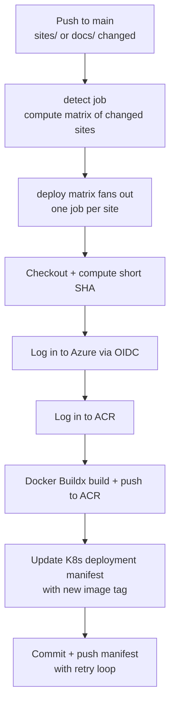
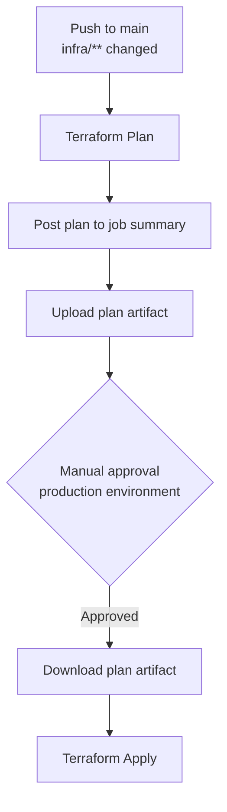

This platform uses GitHub Actions for all CI/CD. There are three workflows in total — a unified site deployment workflow (`deploy.yml`), an infrastructure workflow (`terraform.yml`), and a validation workflow (`validate.yml`). All workflow files live in `.github/workflows/`.

## Design Principles

Every workflow in this repository follows a consistent set of conventions:

- **Path-filtered triggers.** The deploy workflow only runs when files under `sites/**` or `docs/**` change on `main`, avoiding unnecessary builds.
- **Pinned action versions.** All third-party actions are pinned to full commit SHAs rather than tags, preventing supply-chain attacks from tag mutation.
- **OIDC authentication.** Azure credentials are never stored as secrets. GitHub Actions authenticates via OpenID Connect federated identity, configured in the `github-oidc` Terraform module.
- **Concurrency control.** Each site deploys under a per-site concurrency group (`deploy-<site>`, `cancel-in-progress: false`), ensuring in-flight deployments complete before the next one starts while still allowing different sites to deploy in parallel.
- **Manual dispatch.** The deploy workflow supports `workflow_dispatch` with a `site` dropdown (including an `all` option) for manual reruns without requiring a code change.

## Site Deployment Workflow

A single workflow (`deploy.yml`) builds and deploys every containerized site. A `detect` job inspects the push and emits a matrix of changed sites (or takes a single selected site / `all` via `workflow_dispatch`); a `deploy` job then fans out over that matrix. Each site shares an identical deployment pattern — only the Dockerfile location, image name, and manifest path differ, all derived from the matrix site name.

### Shared Pipeline

### Step-by-Step Breakdown

#### Detect job

For push events, the `detect` job diffs `github.event.before..github.event.after` and extracts the site directory names (files under `sites/<site>/…` map to that site; files under `docs/…` map to the `docs-kevinryan-io` site). It keeps only sites that have both a `sites/<site>/Dockerfile` and a `k8s/<site>/deployment.yaml`, and emits a JSON array consumed by the `deploy` matrix. For `workflow_dispatch`, it uses the selected `site` input (or all sites when `all` is chosen).

#### Checkout and compute short SHA (per deploy matrix job)

The repository is checked out and the short commit SHA is captured. This SHA becomes the Docker image tag, providing a direct link between every running container and the commit that produced it.

#### Authenticate to registries

Two logins happen in sequence:

- **Azure** — via OIDC (`azure/login` with `client-id`, `tenant-id`, `subscription-id`)
- **ACR** — using the Azure CLI session established in the previous step

The workflow pushes only to ACR; GHCR is no longer used.

#### Docker build and push

Each image is built with Docker Buildx (enabling build cache via GitHub Actions cache) and pushed to ACR with two tags:

| Tag | Registry | Purpose |
|-----|----------|---------|
| `<sha>` | ACR | Production deployment (K8s pulls from here); immutable version reference |
| `latest` | ACR | Rollback convenience |

The `COMMIT_SHA` build arg is passed so the application can embed its version at build time.

#### Update Kubernetes manifest

The workflow uses `sed` to replace the image tag in `k8s/<site>/deployment.yaml` with the new ACR-tagged image. This is the GitOps trigger — when Flux CD sees this change, it reconciles the cluster.

#### Commit and push with retry

The manifest change is committed as `[deploy] <site>: <sha>` and pushed to `main`. A retry loop (5 attempts with exponential backoff) handles race conditions when multiple matrix jobs push concurrently. Each attempt does a `git pull --rebase` before pushing.

### Workflow Inventory

The repo's three workflows and their trigger paths:

| Workflow | File | Trigger Path | Scope |
|----------|------|--------------|-------|
| Build and Deploy Site | `deploy.yml` | `sites/**` and `docs/**` | All sites with a Dockerfile (aiimmigrants.com, brand.kevinryan.io, distributedequity.org, docs.kevinryan.io, kevinryan.io; hq.kevinryan.io deploys LibreChat from the upstream pre-built image and has no Dockerfile, so the deploy workflow auto-skips it — its manifests deploy via Flux) |
| Terraform Plan and Apply | `terraform.yml` | `infra/**` | Azure infrastructure |
| Validate | `validate.yml` | `k8s/**`, `sites/hq-kevinryan-io/**`, `scripts/**` | Manifest linting + HQ theme drift check |

The `detect` job maps changed paths to sites: files under `sites/<site>/…` map to that site, and files under `docs/…` map to the `docs-kevinryan-io` site, since the docs site symlinks content from the `docs/` directory. Increasing the SHA range (or choosing `all` in `workflow_dispatch`) gives rebuilds for multiple sites in a single run via the matrix.

### Permissions

The deploy workflow requests two permission scopes:

| Permission | Reason |
|------------|--------|
| `contents: write` | Commit the updated K8s manifest back to `main` |
| `id-token: write` | Request an OIDC token for Azure authentication |

## Terraform Workflow

The infrastructure workflow (`terraform.yml`) manages all Azure and Cloudflare resources. It follows a plan/approve/apply pattern with environment protection.

### Pipeline

### Plan Job

Triggered on any push to `main` that changes files under `infra/`:

1. Checkout the repository
2. Set up Terraform CLI
3. Authenticate to Azure via OIDC
4. Run `terraform init` and `terraform plan -out=tfplan`
5. Post the plan output to the GitHub Actions job summary for review
6. Upload the plan file as an artifact for the apply job

### Apply Job

Runs only after the plan job completes **and** a reviewer approves in the `production` GitHub environment:

1. Checkout the repository
2. Set up Terraform and authenticate to Azure
3. Download the plan artifact from the plan job
4. Run `terraform apply tfplan` using the exact plan that was reviewed

This two-stage approach ensures no infrastructure changes are applied without human review, while still keeping the plan deterministic — the same plan file produced during review is the one applied.

### Permissions

| Permission | Reason |
|------------|--------|
| `contents: read` | Read the Terraform configuration |
| `id-token: write` | Request an OIDC token for Azure authentication |

Note that the Terraform workflow only needs `contents: read` (not `write`) since it does not commit anything back to the repository.

### Secrets and Variables

The Terraform workflow passes several secrets as environment variables:

| Variable | Source |
|----------|--------|
| `ARM_CLIENT_ID` / `ARM_TENANT_ID` / `ARM_SUBSCRIPTION_ID` | Azure OIDC identity |
| `TF_VAR_cloudflare_api_token` | Cloudflare API access |
| `TF_VAR_admin_ssh_public_key` | SSH key for VM access |
| `TF_VAR_admin_ip` | IP allowlist for NSG rules |
| `TF_VAR_cloudflare_zone_id` | Cloudflare DNS zone |
| `TF_VAR_acr_name` | Azure Container Registry name |
| `TF_VAR_github_token` | Flux CD GitHub access |

## Validate Workflow

The `validate.yml` workflow guards manifest and overlay quality. It triggers on pushes to `main` and on pull requests (both path-filtered) whenever `k8s/**`, `sites/hq-kevinryan-io/**`, `scripts/**`, or the workflow file itself changes, plus `workflow_dispatch` for manual runs.

It runs a single `manifests` job with two checks:

1. **yamllint** — lints every Kubernetes manifest and workflow file (`yamllint -s .github/workflows/ k8s/`), catching indentation and quoting errors before Flux ever sees them.
2. **HQ theme drift check** — runs `scripts/sync-hq-theme.sh --check`, regenerating the `librechat-custom` ConfigMap from the theme sources and failing if the committed ConfigMap differs. This is the CI-side half of the ADR-023 overlay contract: the deployed HQ theming must always be derivable from `sites/hq-kevinryan-io/` sources, never hand-edited. (The script uses `kubectl create configmap --dry-run=client` to generate the expected output, so kubectl is installed client-only — no cluster access.)

The workflow only requests `contents: read` — it is read-only by design and never writes to the repository or touches the cluster.

## Security Considerations

- **No long-lived credentials.** Azure authentication uses OIDC federated identity throughout. No client secrets are stored in GitHub.
- **Pinned actions.** Every `uses:` reference is pinned to a full commit SHA with a version comment, preventing compromised tags from injecting malicious code.
- **Least privilege.** Each workflow requests only the permissions it needs. Deploy workflows need write access; Terraform only needs read.
- **Environment protection.** Terraform apply requires manual approval via GitHub's `production` environment, preventing accidental infrastructure changes.
- **Concurrency groups.** Per-site groups prevent parallel deployments to the same site from creating race conditions in the cluster.

## Adding a New Site

The unified workflow auto-discovers new sites — no workflow editing required to trigger on changes:

1. Add the site package under `sites/<site>/` with a `Dockerfile`
2. Add the Flux manifests under `k8s/<site>/` including a `deployment.yaml` whose `image:` references `${ACR_LOGIN_SERVER}/<site>:<tag>`
3. Add the site name to the `workflow_dispatch.inputs.site.options` dropdown in `deploy.yml` so it can be manually dispatched
4. The next push to `main` that changes files under `sites/<site>/` will automatically trigger a build and deploy
