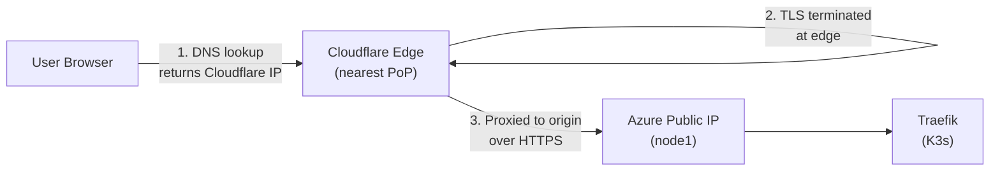
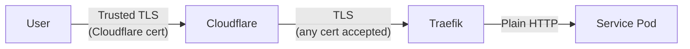

All public traffic to this platform flows through <a href="https://www.cloudflare.com/" target="_blank" rel="noopener noreferrer">Cloudflare</a>. Cloudflare serves as the DNS provider, CDN, DDoS shield, and edge TLS terminator for every domain. DNS records and cache rules are managed entirely through Terraform.

## What Cloudflare Provides

| Capability | How It's Used |
|------------|---------------|
| **DNS** | Authoritative nameserver for all three domain zones |
| **CDN caching** | Static assets cached at 300+ edge locations worldwide |
| **DDoS protection** | Always-on L3/L4/L7 mitigation on the free plan |
| **TLS at the edge** | Cloudflare-issued certificates presented to end users |
| **Serve stale** | Cached content served when the origin is down |
| **IP masking** | Origin server IP hidden behind Cloudflare proxy |

All of this runs on Cloudflare's free plan — no paid features are required.

## Traffic Flow



1. The user's DNS lookup returns a Cloudflare anycast IP (not the origin server IP)
2. Cloudflare terminates TLS using its own managed certificate
3. If the response is cached, Cloudflare serves it directly from the edge — the request never reaches the origin
4. For cache misses, Cloudflare proxies the request to the origin over HTTPS (Full SSL mode)
5. Traefik receives the request and routes to the correct service

## Domain Zones

Four separate Cloudflare zones are managed, each with its own zone ID:

| Zone | Domain | Subdomains | Terraform Reference |
|------|--------|------------|-------------------|
| kevinryan.io | `kevinryan.io` | `www`, `brand`, `docs`, `hq`, `analytics`, `monitoring`, `dam` | `module.cloudflare` + root records |
| aiimmigrants.com | `aiimmigrants.com` | `www` | `module.cloudflare_aiimmigrants` |
| distributedequity.org | `distributedequity.org` | `www` | `module.cloudflare_distributedequity` |
| ai-native-engineer.io | `ai-native-engineer.io` | `www` | `module.cloudflare_ainativeengineer` |

## DNS Records

### Per-Zone Records (Cloudflare Module)

The Cloudflare Terraform module creates DNS records for each domain zone. Every zone gets:

| Record | Type | Name | Content | Proxied |
|--------|------|------|---------|---------|
| Root | A | `@` | node1 public IP | Yes (orange cloud) |
| WWW | A | `www` | node1 public IP | Yes (orange cloud) |
| Subdomains | A | `<subdomain>` | node1 public IP | Yes (orange cloud) |

All records are **proxied** (orange cloud enabled), meaning:

- DNS lookups return Cloudflare's anycast IP, not the origin
- Traffic is routed through Cloudflare's network
- The origin server's real IP is never exposed
- CDN caching and DDoS protection are active

The TTL is set to `1` (automatic) for all proxied records, as Cloudflare manages caching independently of DNS TTL.

### kevinryan.io Zone Detail

The `kevinryan.io` zone has the most records since it hosts both site subdomains and platform service subdomains:

| Record | Hostname | Managed By |
|--------|----------|------------|
| `@` | kevinryan.io | Cloudflare module |
| `www` | www.kevinryan.io | Cloudflare module |
| `brand` | brand.kevinryan.io | Cloudflare module (subdomain list) |
| `docs` | docs.kevinryan.io | Cloudflare module (subdomain list) |
| `analytics` | analytics.kevinryan.io | Root module (standalone record) |
| `monitoring` | monitoring.kevinryan.io | Root module (standalone record) |

The `analytics` and `monitoring` records are managed directly in the root Terraform module rather than via the Cloudflare module, since they are platform service subdomains rather than site subdomains:

```hcl
resource "cloudflare_record" "analytics" {
  zone_id = var.cloudflare_zone_id
  name    = "analytics"
  content = module.network.public_ip_address
  type    = "A"
  proxied = true
  ttl     = 1
}

resource "cloudflare_record" "monitoring" {
  zone_id = var.cloudflare_zone_id
  name    = "monitoring"
  content = module.network.public_ip_address
  type    = "A"
  proxied = true
  ttl     = 1
}
```

### Complete DNS Map

Every hostname in the platform and what it resolves to:

| Hostname | Site/Service |
|----------|-------------|
| `kevinryan.io` | Portfolio |
| `www.kevinryan.io` | Portfolio |
| `brand.kevinryan.io` | Brand Guidelines |
| `docs.kevinryan.io` | Documentation |
| `analytics.kevinryan.io` | Umami Analytics |
| `monitoring.kevinryan.io` | Grafana |
| `aiimmigrants.com` | AI Immigrants |
| `www.aiimmigrants.com` | AI Immigrants |
| `distributedequity.org` | Distributed Equity |
| `www.distributedequity.org` | Distributed Equity |

All 10 hostnames resolve to Cloudflare's edge, which proxies to the same origin (node1's public IP). Traefik handles host-based routing at the cluster level.

## TLS Configuration

### SSL Mode: Full

Cloudflare's SSL/TLS mode is set to **Full** (configured in the Cloudflare dashboard). This means:

| Segment | Encryption | Certificate |
|---------|-----------|-------------|
| User → Cloudflare | HTTPS | Cloudflare Universal SSL (trusted, auto-renewed) |
| Cloudflare → Origin | HTTPS | Traefik default cert (self-signed acceptable) |



**Full** mode (not Full Strict) is used because Traefik serves a self-signed certificate by default. Full mode encrypts traffic between Cloudflare and the origin but does not require a CA-signed certificate on the origin. This provides encryption in transit without the overhead of managing Let's Encrypt certificates on the cluster.

> **Note:** SSL mode is currently configured manually in the Cloudflare dashboard rather than via Terraform. The API token lacks `Zone Settings:Edit` permission, and the relevant Terraform resource has known issues with read-only settings.

## CDN Caching

### Cache Rules

Each domain zone has a Terraform-managed cache ruleset that overrides origin cache headers:

```hcl
resource "cloudflare_ruleset" "cache" {
  zone_id     = var.zone_id
  name        = "Cache rules for ${var.domain}"
  description = "Cache static site and serve stale on origin failure"
  kind        = "zone"
  phase       = "http_request_cache_settings"

  rules {
    action = "set_cache_settings"
    action_parameters {
      cache = true
      edge_ttl {
        mode    = "override_origin"
        default = 86400
      }
      serve_stale {
        disable_stale_while_updating = false
      }
    }
    expression  = local.cache_expression
    description = "Serve stale content on origin failure"
    enabled     = true
  }
}
```

| Setting | Value | Effect |
|---------|-------|--------|
| `cache` | `true` | Enable caching for all matching requests |
| `edge_ttl` | 86,400s (24 hours) | Cache content at the edge for 24 hours, overriding any `Cache-Control` headers from the origin |
| `serve_stale` | Enabled | Serve cached (potentially stale) content if the origin is unreachable |
| `disable_stale_while_updating` | `false` | Continue serving stale content while fetching a fresh copy in the background |

### Cache Expression

The cache rule applies to all hostnames in the zone. The expression is dynamically constructed from the domain and its subdomains:

```text
(http.host eq "kevinryan.io") or (http.host eq "www.kevinryan.io") or (http.host eq "brand.kevinryan.io") or (http.host eq "docs.kevinryan.io") or (http.host eq "hq.kevinryan.io")
```

Subdomains listed in `cache_bypass_subdomains` (currently `hq`) additionally get a **bypass rule**: cache is skipped for auth, API, login, and root routes on those hosts, so the LibreChat app never serves a cached login or API response.

For zones without subdomains (e.g. `aiimmigrants.com`), the expression covers just the root and www:

```text
(http.host eq "aiimmigrants.com") or (http.host eq "www.aiimmigrants.com")
```

### Serve Stale: Resilience Without Redundancy

The `serve_stale` setting is particularly important for this platform. With a single-origin architecture (one K3s cluster, one public IP), there is no automatic failover. If the origin goes down:

- **Without serve stale:** All requests fail immediately
- **With serve stale:** Cloudflare continues serving the last cached version of every page for the duration of the edge TTL

For static sites that change infrequently, this provides effective resilience without the cost of a redundant origin. Visitors experience no disruption as long as the content they request was cached within the last 24 hours.

## DDoS Protection

All proxied records benefit from Cloudflare's DDoS mitigation:

- **L3/L4 protection** — volumetric and protocol attacks are absorbed by Cloudflare's network before reaching the origin
- **L7 protection** — HTTP flood protection filters malicious requests at the application layer
- **Always on** — no configuration needed, included in the free plan
- **IP masking** — the origin IP is never exposed in DNS responses, preventing direct-to-origin attacks

This is especially relevant for a single-origin platform where the origin has no redundancy. Cloudflare acts as a shield that absorbs attack traffic at the edge.

## Security Benefits

Beyond DDoS protection, proxying through Cloudflare provides:

| Benefit | How |
|---------|-----|
| **Hidden origin IP** | DNS returns Cloudflare IPs, not the Azure VM's public IP |
| **Bot mitigation** | Basic bot management on the free plan filters known bad actors |
| **Browser integrity check** | Challenges requests with suspicious characteristics |
| **Hotlink protection** | Prevents other sites from embedding your assets |

## Terraform Module

The Cloudflare module (`infra/modules/cloudflare/`) is called once per domain zone:

```hcl
module "cloudflare" {
  source       = "./modules/cloudflare"
  zone_id      = var.cloudflare_zone_id
  vm_public_ip = module.network.public_ip_address
  domain       = "kevinryan.io"
  subdomains   = ["brand", "docs"]
}

module "cloudflare_aiimmigrants" {
  source       = "./modules/cloudflare"
  zone_id      = var.cloudflare_zone_id_aiimmigrants
  vm_public_ip = module.network.public_ip_address
  domain       = "aiimmigrants.com"
}
```

Each invocation creates:

- Root `A` record (`@`)
- `www` `A` record
- One `A` record per entry in `subdomains`
- A cache ruleset covering all hostnames in the zone

### Variables

| Variable | Description |
|----------|-------------|
| `zone_id` | Cloudflare zone ID (one per domain) |
| `vm_public_ip` | Origin server IP (node1's Azure public IP) |
| `domain` | Domain name (used in cache rule expressions) |
| `subdomains` | List of additional subdomain records (default: `[]`) |

## Adding a New Domain

To add a new domain to the platform:

1. Register the domain and set Cloudflare as the authoritative nameserver
2. Add the zone ID as a new Terraform variable in `infra/variables.tf`
3. Add a new Cloudflare module call in `infra/main.tf`:

```hcl
module "cloudflare_newsite" {
  source       = "./modules/cloudflare"
  zone_id      = var.cloudflare_zone_id_newsite
  vm_public_ip = module.network.public_ip_address
  domain       = "newsite.com"
}
```

1. Pass the zone ID value via `terraform.tfvars` or as a GitHub Actions secret
1. Run `terraform plan` and `terraform apply` (via the Terraform workflow)

The module handles root, www, and cache rule creation automatically. For additional subdomains, add them to the `subdomains` list.

### Adding a Subdomain to an Existing Zone

For subdomains on `kevinryan.io` (e.g. a new `api.kevinryan.io`):

- **Site subdomains** — add the subdomain to the `subdomains` list in the existing `module.cloudflare` call
- **Service subdomains** — add a standalone `cloudflare_record` resource in the root module (as done for `analytics` and `monitoring`)
