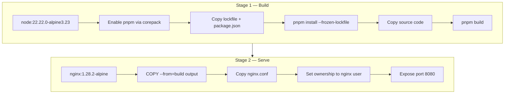

Every site in the platform is containerised and served by nginx. The Dockerfile strategy depends on whether the site has a build step.

## Build Strategies

| Strategy | Sites | Base Images |
|----------|-------|-------------|
| Multi-stage | kevinryan.io, docs.kevinryan.io, ai-native-engineer.io | `node:22.22.0-alpine3.23` → `nginx:1.28.2-alpine` |
| Single-stage | brand, aiimmigrants, distributedequity | `nginx:1.28.2-alpine` |

## Multi-Stage Builds

Sites with a Node.js build step (Next.js, Astro) use a two-stage Dockerfile. The first stage installs dependencies and compiles the site. The second stage copies only the built output into a minimal nginx image. The final production image contains no Node.js runtime, no `node_modules`, and no source code.



### kevinryan.io

The portfolio site builds with Next.js static export:

```dockerfile
# Stage 1 — Build
FROM node:22.22.0-alpine3.23 AS build

ARG COMMIT_SHA=dev
ENV NEXT_PUBLIC_COMMIT_SHA=${COMMIT_SHA}

RUN corepack enable && corepack prepare pnpm@latest --activate

WORKDIR /app

COPY pnpm-lock.yaml pnpm-workspace.yaml ./
COPY sites/kevinryan-io/package.json ./sites/kevinryan-io/

WORKDIR /app/sites/kevinryan-io
RUN pnpm install --frozen-lockfile

WORKDIR /app
COPY sites/kevinryan-io/ ./sites/kevinryan-io/

WORKDIR /app/sites/kevinryan-io
RUN pnpm build

# Stage 2 — Serve
FROM nginx:1.28.2-alpine

COPY --from=build /app/sites/kevinryan-io/out /usr/share/nginx/html
COPY sites/kevinryan-io/nginx.conf /etc/nginx/nginx.conf

RUN chown -R nginx:nginx /usr/share/nginx/html && \
    chown -R nginx:nginx /var/cache/nginx && \
    chown -R nginx:nginx /var/log/nginx && \
    touch /run/nginx.pid && \
    chown nginx:nginx /run/nginx.pid

USER nginx
EXPOSE 8080
CMD ["nginx", "-g", "daemon off;"]
```

Key details:

- The `COMMIT_SHA` build arg is exposed as `NEXT_PUBLIC_COMMIT_SHA`, making the commit hash available in the client-side bundle for version identification.
- Dependency installation is separated from source copy. This means `pnpm install` is cached by Docker's layer cache and only re-runs when `pnpm-lock.yaml` or `package.json` changes.
- The build output (`out/`) is a fully static export — HTML, CSS, JS, and assets with no server runtime.

### docs.kevinryan.io

The docs site builds with Astro and has extra complexity due to symlinked content:

```dockerfile
# Stage 1 — Build
FROM node:22.22.0-alpine3.23 AS build

ARG COMMIT_SHA=dev
ENV PUBLIC_COMMIT_SHA=${COMMIT_SHA}

RUN corepack enable && corepack prepare pnpm@latest --activate

WORKDIR /app

COPY pnpm-lock.yaml pnpm-workspace.yaml ./
COPY sites/docs-kevinryan-io/package.json ./sites/docs-kevinryan-io/

WORKDIR /app/sites/docs-kevinryan-io
RUN pnpm install --frozen-lockfile

WORKDIR /app
COPY docs/ ./docs/
COPY .sdd/ ./.sdd/
COPY sites/docs-kevinryan-io/ ./sites/docs-kevinryan-io/

# Replace symlinks with real content
RUN rm -rf /app/sites/docs-kevinryan-io/src/content/docs && \
    cp -rL /app/docs /app/sites/docs-kevinryan-io/src/content/docs

WORKDIR /app/sites/docs-kevinryan-io
RUN pnpm build

# Stage 2 — Serve
FROM nginx:1.28.2-alpine

COPY --from=build /app/sites/docs-kevinryan-io/dist /usr/share/nginx/html
COPY sites/docs-kevinryan-io/nginx.conf /etc/nginx/nginx.conf

RUN chown -R nginx:nginx /usr/share/nginx/html && \
    chown -R nginx:nginx /var/cache/nginx && \
    chown -R nginx:nginx /var/log/nginx && \
    touch /run/nginx.pid && \
    chown nginx:nginx /run/nginx.pid

USER nginx
EXPOSE 8080
CMD ["nginx", "-g", "daemon off;"]
```

Key details:

- The `docs/` and `.sdd/` directories are copied from the monorepo root into the build context because Docker `COPY` does not follow symlinks that point outside the copied tree.
- A `cp -rL` step resolves the symlinks inside the container, replacing them with real copies before the Astro build runs.
- The build output (`dist/`) is the fully rendered static documentation site.

## Single-Stage Builds

The three static HTML sites have no build step. Their Dockerfiles copy pre-built `public/` files straight into nginx:

```dockerfile
FROM nginx:1.28.2-alpine

ARG COMMIT_SHA=dev

COPY sites/<site-name>/public/ /usr/share/nginx/html/
COPY sites/<site-name>/nginx.conf /etc/nginx/nginx.conf

RUN sed -i "s/{{COMMIT_SHA}}/${COMMIT_SHA}/g" /usr/share/nginx/html/index.html

RUN chown -R nginx:nginx /usr/share/nginx/html && \
    chown -R nginx:nginx /var/cache/nginx && \
    chown -R nginx:nginx /var/log/nginx && \
    touch /run/nginx.pid && \
    chown nginx:nginx /run/nginx.pid

USER nginx
EXPOSE 8080
CMD ["nginx", "-g", "daemon off;"]
```

The `COMMIT_SHA` is injected at build time via `sed`, replacing a `{{COMMIT_SHA}}` placeholder in `index.html`. This provides version traceability without requiring a Node.js build step.

## Shared Conventions

All six Dockerfiles share these conventions regardless of build strategy:

### Non-Root Execution

Every container runs as the `nginx` user. The Dockerfile explicitly sets ownership of all writable paths (`html`, `cache`, `log`, `pid`) and declares `USER nginx` before the entrypoint. No container in this platform runs as root.

### Port 8080

All containers listen on port 8080 rather than the default 80. This avoids requiring elevated privileges to bind to a privileged port and aligns with the non-root execution model.

### Health Check Endpoint

Every nginx configuration includes a `/healthz` endpoint that returns `200 OK` with logging disabled:

```nginx
location /healthz {
    access_log off;
    default_type text/plain;
    return 200 "ok";
}
```

This endpoint is used by Kubernetes liveness and readiness probes to determine container health without polluting access logs.

### OCI Labels

Every image carries an `org.opencontainers.image.source` label pointing to the GitHub repository, enabling GitHub to associate container images with their source.

### JSON Structured Logging

Nginx is configured with a JSON log format across all sites:

```nginx
log_format json_combined escape=json
    '{'
        '"time":"$time_iso8601",'
        '"remote_addr":"$remote_addr",'
        '"request":"$request",'
        '"status":$status,'
        '"body_bytes_sent":$body_bytes_sent,'
        '"request_time":"$request_time",'
        '"http_user_agent":"$http_user_agent"'
    '}';
```

This format is consumed by Promtail and shipped to Loki for log aggregation in the observability stack.

### Security Headers

All responses include hardened headers:

| Header | Value | Purpose |
|--------|-------|---------|
| `X-Content-Type-Options` | `nosniff` | Prevents MIME type sniffing |
| `X-Frame-Options` | `DENY` | Prevents clickjacking via iframes |
| `Referrer-Policy` | `strict-origin-when-cross-origin` | Limits referrer information leakage |
| `server_tokens` | `off` | Hides the nginx version from response headers |

### Build Cache

All images are built with Docker Buildx using GitHub Actions cache (`cache-from: type=gha`, `cache-to: type=gha,mode=max`). For multi-stage builds, the dependency install layer is cached separately from the source copy, so rebuilds after code-only changes skip the `pnpm install` step entirely.

### Alpine Base

Both base images (`node:22.22.0-alpine3.23` and `nginx:1.28.2-alpine`) use Alpine Linux, keeping image sizes minimal. The final production images for static sites are typically under 30MB.
