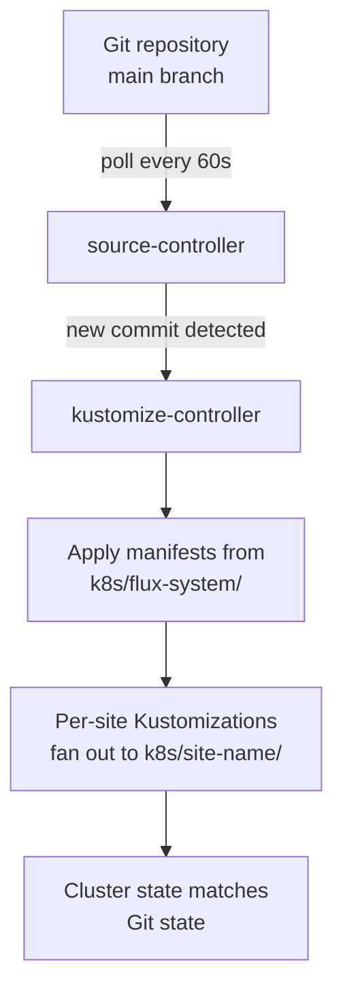
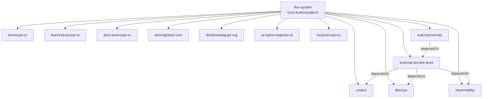

This platform uses <a href="https://fluxcd.io/" target="_blank" rel="noopener noreferrer">Flux CD</a> v2.8.1 to implement GitOps — the Kubernetes cluster continuously reconciles its desired state from the `k8s/` directory of this repository. No manual `kubectl apply` is needed; every change merged to `main` is automatically deployed.

## How It Works

Flux runs two controllers inside the cluster:

- **source-controller** — polls the Git repository for changes every 60 seconds
- **kustomize-controller** — applies the Kubernetes manifests when changes are detected

The reconciliation loop:



When a CI/CD workflow updates an image tag in a deployment manifest and pushes to `main`, Flux detects the change within its polling interval and rolls out the new image automatically.

## Bootstrap Configuration

Flux is bootstrapped with two core resources in `k8s/flux-system/gotk-sync.yaml`:

**GitRepository** — tells Flux where to find the source:

```yaml
apiVersion: source.toolkit.fluxcd.io/v1
kind: GitRepository
metadata:
  name: flux-system
  namespace: flux-system
spec:
  interval: 1m0s
  ref:
    branch: main
  secretRef:
    name: flux-system
  url: https://github.com/kevin-ryan-associates/kra-platform.git
```

**Root Kustomization** — tells Flux which path to reconcile:

```yaml
apiVersion: kustomize.toolkit.fluxcd.io/v1
kind: Kustomization
metadata:
  name: flux-system
  namespace: flux-system
spec:
  interval: 10m0s
  path: ./k8s/flux-system
  prune: true
  sourceRef:
    kind: GitRepository
    name: flux-system
```

The `prune: true` setting means Flux will delete resources from the cluster if they are removed from Git — keeping the cluster tightly in sync with the repository.

## Kustomization Hierarchy

The root Kustomization points to `k8s/flux-system/`, which contains a `kustomization.yaml` that lists all managed resources:

```yaml
apiVersion: kustomize.config.k8s.io/v1beta1
kind: Kustomization
resources:
  - gotk-components.yaml
  - gotk-sync.yaml
  - kevinryan-io-sync.yaml
  - brand-kevinryan-io-sync.yaml
  - aiimmigrants-com-sync.yaml
  - distributedequity-org-sync.yaml
  - ai-native-engineer-io-sync.yaml
  - docs-kevinryan-io-sync.yaml
  - external-secrets-sync.yaml
  - external-secrets-store-sync.yaml
  - umami-sync.yaml
  - directus-sync.yaml
  - observability-sync.yaml
  - hq-kevinryan-io-sync.yaml
```

Each `*-sync.yaml` file is a Flux `Kustomization` CR that points to a subdirectory of `k8s/`. This creates a fan-out pattern where the root Kustomization manages child Kustomizations, and each child manages its own set of manifests independently.



## Dependency Ordering

Not all Kustomizations are independent. Some use `dependsOn` to establish ordering:

| Kustomization | Depends On | Reason |
|---------------|------------|--------|
| `external-secrets-store` | `external-secrets` | The `ClusterSecretStore` CRD must exist before creating the store |
| `umami` | `external-secrets-store` | Umami's `ExternalSecret` references the `ClusterSecretStore` |
| `observability` | `external-secrets-store` | Grafana's `ExternalSecret` references the `ClusterSecretStore` |

Site Kustomizations have no dependencies and can reconcile independently and in parallel.

## Per-Site Manifests

Every site follows an identical manifest structure. Each site directory under `k8s/` contains four plain YAML files — no Kustomize overlays, no Helm charts:

| File | Resource | Purpose |
|------|----------|---------|
| `namespace.yaml` | `Namespace` | Isolates the site in its own namespace |
| `deployment.yaml` | `Deployment` | Single replica pulling from ACR, with health probes and resource limits |
| `service.yaml` | `Service` | ClusterIP service mapping port 80 to the container's port 8080 |
| `ingress.yaml` | `IngressRoute` (Traefik) | TLS-terminated routing from the public domain to the service |

### Example: kevinryan.io

**Deployment** — a single nginx-based container serving static content:

```yaml
apiVersion: apps/v1
kind: Deployment
metadata:
  name: kevinryan-io
  namespace: kevinryan-io
spec:
  replicas: 1
  selector:
    matchLabels:
      app: kevinryan-io
  template:
    metadata:
      labels:
        app: kevinryan-io
    spec:
      containers:
        - name: kevinryan-io
          image: kevinryanacr.azurecr.io/kevinryan-io:08a2c8e
          ports:
            - containerPort: 8080
          livenessProbe:
            httpGet:
              path: /healthz
              port: 8080
            initialDelaySeconds: 5
            periodSeconds: 10
          readinessProbe:
            httpGet:
              path: /healthz
              port: 8080
            initialDelaySeconds: 3
            periodSeconds: 5
          resources:
            requests:
              cpu: 10m
              memory: 16Mi
            limits:
              cpu: 100m
              memory: 64Mi
```

**IngressRoute** — Traefik routes HTTPS traffic for both the apex and www subdomain:

```yaml
apiVersion: traefik.io/v1alpha1
kind: IngressRoute
metadata:
  name: kevinryan-io
  namespace: kevinryan-io
spec:
  entryPoints:
    - websecure
  routes:
    - match: Host(`kevinryan.io`) || Host(`www.kevinryan.io`)
      kind: Rule
      services:
        - name: kevinryan-io
          port: 80
  tls: {}
```

The image tag (e.g. `08a2c8e`) is the short commit SHA, updated automatically by the CI/CD workflow on each deploy. When Flux sees the tag change, it triggers a rolling update.

## External Secrets

Sensitive configuration is stored in Azure Key Vault and synced into Kubernetes secrets at runtime using the <a href="https://external-secrets.io/" target="_blank" rel="noopener noreferrer">External Secrets Operator</a>.

### Operator Installation

The operator is installed via a Flux-managed HelmRelease in `k8s/external-secrets/`:

```yaml
apiVersion: helm.toolkit.fluxcd.io/v2
kind: HelmRelease
metadata:
  name: external-secrets
  namespace: external-secrets
spec:
  interval: 1h
  chart:
    spec:
      chart: external-secrets
      version: ">=2.0.0 <3.0.0"
      sourceRef:
        kind: HelmRepository
        name: external-secrets
```

### ClusterSecretStore

A single `ClusterSecretStore` in `k8s/external-secrets-store/` connects to Azure Key Vault using the VM's managed identity — no credentials needed:

```yaml
apiVersion: external-secrets.io/v1
kind: ClusterSecretStore
metadata:
  name: azure-keyvault
spec:
  provider:
    azurekv:
      authType: ManagedIdentity
      vaultUrl: "https://kv-kevinryan-io.vault.azure.net/"
```

### Secret Mapping

Each service that needs secrets defines an `ExternalSecret` that references the `ClusterSecretStore` and maps Key Vault secrets into Kubernetes secret keys.

**Umami** — constructs a `DATABASE_URL` from individual Key Vault secrets:

```yaml
apiVersion: external-secrets.io/v1
kind: ExternalSecret
metadata:
  name: umami-db
  namespace: umami
spec:
  refreshInterval: 1h
  secretStoreRef:
    kind: ClusterSecretStore
    name: azure-keyvault
  target:
    name: umami-db
    template:
      data:
        DATABASE_URL: "postgresql://{{ .pg_admin_username }}:{{ .pg_admin_password }}@{{ .pg_fqdn }}:5432/umami_db?sslmode=require"
        APP_SECRET: "{{ .umami_app_secret }}"
  data:
    - secretKey: pg_admin_username
      remoteRef:
        key: pg-admin-username
    - secretKey: pg_admin_password
      remoteRef:
        key: pg-admin-password
    - secretKey: pg_fqdn
      remoteRef:
        key: pg-fqdn
    - secretKey: umami_app_secret
      remoteRef:
        key: umami-app-secret
```

**Grafana** — maps database connection details and admin password:

```yaml
apiVersion: external-secrets.io/v1
kind: ExternalSecret
metadata:
  name: grafana-db
  namespace: observability
spec:
  refreshInterval: 1h
  secretStoreRef:
    kind: ClusterSecretStore
    name: azure-keyvault
  target:
    name: grafana-db
    template:
      data:
        GF_DATABASE_TYPE: "postgres"
        GF_DATABASE_HOST: "{{ .pg_fqdn }}:5432"
        GF_DATABASE_NAME: "grafana_db"
        GF_DATABASE_USER: "{{ .pg_admin_username }}"
        GF_DATABASE_PASSWORD: "{{ .pg_admin_password }}"
        GF_DATABASE_SSL_MODE: "require"
        GF_SECURITY_ADMIN_PASSWORD: "{{ .grafana_admin_password }}"
```

Secrets are refreshed every hour. If a Key Vault secret is rotated, the Kubernetes secret updates automatically without redeployment.

## Observability Stack

The observability stack is deployed entirely through Flux HelmReleases in `k8s/observability/`. All components are pinned to semver ranges and schedule to nodes with the `role: observability` label.

| Component | Chart | Purpose |
|-----------|-------|---------|
| **Grafana** | `grafana` (community) | Dashboards at monitoring.kevinryan.io |
| **Loki** | `loki` (grafana) | Log aggregation (single binary mode, filesystem storage, 31-day retention) |
| **Promtail** | `promtail` (grafana) | Log collection agent (DaemonSet shipping to Loki) |
| **VictoriaMetrics** | `victoria-metrics-k8s-stack` | Metrics collection (VMSingle, VMAgent, node-exporter, kube-state-metrics) |

Grafana is pre-configured with two datasources:

- **Loki** at `http://loki.observability.svc.cluster.local:3100`
- **VictoriaMetrics** at `http://vmsingle-vm.observability.svc.cluster.local:8428`

Two custom Grafana dashboards are deployed as ConfigMaps with the `grafana_dashboard: "1"` sidecar label:

- **Flux CD** — reconciliation activity, errors/warnings, and controller logs
- **Platform Overview** — log volume by namespace, error rate, and recent errors

## Umami Analytics

Umami runs as a single-replica deployment pulling the official `ghcr.io/umami-software/umami:postgresql-latest` image. It connects to Azure PostgreSQL via the `umami-db` ExternalSecret and is exposed at `analytics.kevinryan.io` through a Traefik IngressRoute.

## Ingress and TLS

All ingress is handled by Traefik using `IngressRoute` resources (CRD `traefik.io/v1alpha1`). Every route uses the `websecure` entry point with `tls: {}`, which delegates certificate management to Traefik's default TLS configuration.

Each site routes one or two hostnames (apex + www) to its ClusterIP service on port 80.

## Adding a New Site to Flux

To onboard a new site:

1. Create plain manifests in `k8s/<site-name>/`:
   - `namespace.yaml` — a new namespace
   - `deployment.yaml` — single replica, ACR image, health probes, resource limits
   - `service.yaml` — ClusterIP on port 80 targeting the container port
   - `ingress.yaml` — Traefik `IngressRoute` with domain routing and TLS

2. Create `k8s/flux-system/<site-name>-sync.yaml`:

```yaml
apiVersion: kustomize.toolkit.fluxcd.io/v1
kind: Kustomization
metadata:
  name: <site-name>
  namespace: flux-system
spec:
  interval: 10m0s
  path: ./k8s/<site-name>
  prune: true
  sourceRef:
    kind: GitRepository
    name: flux-system
```

1. Add `<site-name>-sync.yaml` to the `resources` list in `k8s/flux-system/kustomization.yaml`.

1. Merge to `main`. Flux will detect the new Kustomization and apply the site manifests within its reconciliation interval.
