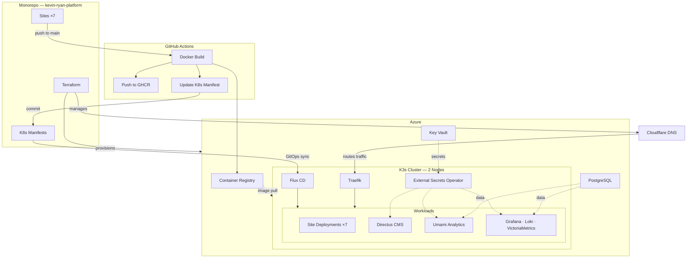
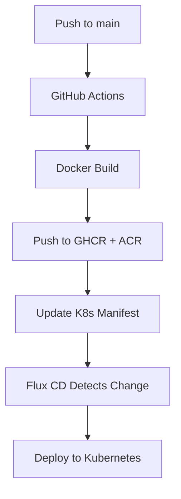

Welcome to the platform documentation. This repository is a **monorepo** hosting all sites, infrastructure-as-code, Kubernetes manifests, and documentation for [kevinryan.io](https://kevinryan.io).

## Why a Monorepo?

A monorepo does not mean a monolith. This repository contains multiple independently deployable sites and services — each with its own Dockerfile, CI/CD pipeline, and Kubernetes namespace — while sharing a single version-controlled source of truth.

The monorepo approach was chosen deliberately for several reasons:

- **AI agent context.** A monorepo gives AI coding agents full visibility across application code, infrastructure definitions, deployment manifests, and documentation in a single repository. This eliminates the context engineering overhead of stitching together knowledge from scattered microservice repos, and allows agents to reason about cross-cutting changes (e.g. adding a new site end-to-end) with far less prompting.
- **Atomic changes.** A single commit can update application code, its Kubernetes manifests, Terraform configuration, and documentation together — making changes reviewable and revertible as a unit.
- **Shared tooling.** Linting, formatting, commit hooks, and CI/CD patterns are defined once and applied consistently across all sites.
- **Discoverability.** New contributors (human or AI) can understand the entire platform from one place rather than navigating a constellation of repositories.

The tradeoff is a larger repository, but path-filtered CI/CD workflows ensure that only the affected site is built and deployed on each push.

## Sites

| Site | URL | Stack | Build |
|------|-----|-------|-------|
| Portfolio | [kevinryan.io](https://kevinryan.io) | Next.js 16, React 19, TypeScript, Tailwind CSS 4 | `next build` (static export) |
| Brand Guidelines | [brand.kevinryan.io](https://brand.kevinryan.io) | Static HTML | None |
| Docs | [docs.kevinryan.io](https://docs.kevinryan.io) | Astro Starlight | `astro build` |
| HQ (LibreChat) | [hq.kevinryan.io](https://hq.kevinryan.io) | Upstream LibreChat image (digest-pinned), internal MongoDB | None — upstream image, no build step |
| AI-Native Engineer | [ai-native-engineer.io](https://ai-native-engineer.io) | Astro 5, TypeScript | `astro build` |
| AI Immigrants | [aiimmigrants.com](https://aiimmigrants.com) | Static HTML | None |
| Distributed Equity | [distributedequity.org](https://distributedequity.org) | Static HTML | None |

Sites with no build step serve static HTML directly via nginx. All sites are containerised and deployed identically regardless of their build toolchain. **hq.kevinryan.io is the exception**: it deploys the upstream pre-built LibreChat image (never `:latest`) with theming applied as an overlay layer — see ADR-023.

## Repository Structure

```text
kevin-ryan-platform/
├── .github/workflows/         # CI/CD — shared deploy workflow, Terraform, and validation
├── infra/                     # Terraform — Azure VMs, ACR, Key Vault, PostgreSQL, Cloudflare DNS
├── scripts/                   # Helper scripts (sync-hq-theme.sh — HQ theme ConfigMap sync)
├── k8s/                       # Kubernetes manifests
│   ├── flux-system/           # Flux CD bootstrap + per-site Kustomization CRs
│   ├── kevinryan-io/           # Plain manifests (static export)
│   ├── hq-kevinryan-io/        # Plain manifests (LibreChat + theme overlay)
│   ├── docs-kevinryan-io/      # Plain manifests (Astro static)
│   ├── brand-kevinryan-io/     # Plain manifests (static HTML)
│   ├── aiimmigrants-com/      # Plain manifests (static HTML)
│   ├── distributedequity-org/ # Plain manifests (static HTML)
│   ├── ai-native-engineer-io/ # Plain manifests (Astro static export)
│   ├── directus/              # Directus headless CMS (shared)
│   ├── external-secrets/      # External Secrets Operator
│   ├── external-secrets-store/ # ClusterSecretStore (Azure Key Vault)
│   ├── umami/                 # Umami analytics
│   └── observability/         # Grafana, Loki, Promtail, VictoriaMetrics
├── sites/                     # Application code — one directory per site
│   ├── kevinryan-io/          # Next.js 16 (App Router)
│   ├── hq-kevinryan-io/       # LibreChat (upstream image + theme overlay — no build step)
│   ├── docs-kevinryan-io/     # Astro Starlight
│   ├── brand-kevinryan-io/    # Static HTML
│   ├── aiimmigrants-com/      # Static HTML
│   ├── distributedequity-org/ # Static HTML
│   └── ai-native-engineer-io/ # Astro 5 book site
├── docs/                      # Documentation content (symlinked into docs site)
└── pnpm-workspace.yaml
```

## Architecture Overview



**Solid arrows** trace the deployment path from code push to running workload. **Dotted arrows** represent runtime dependencies — image pulls, secret injection, and data connections.

## Infrastructure

All infrastructure is defined in Terraform and deployed to Azure:

- **Compute** — Two-node K3s cluster on Ubuntu 24.04 LTS VMs
- **Container Registry** — Azure Container Registry (ACR) for production image pulls; GitHub Container Registry (GHCR) as a secondary
- **Secrets** — Azure Key Vault, synced into Kubernetes via External Secrets Operator
- **Database** — Azure PostgreSQL Flexible Server (backing Umami analytics and Grafana)
- **DNS** — Cloudflare manages DNS for all domains, routing traffic to the cluster's Traefik ingress
- **CI/CD authentication** — GitHub Actions authenticates to Azure via OIDC (no stored secrets)

## Deployment

Each site has a dedicated GitHub Actions workflow triggered by path-filtered pushes to `main`:



Flux CD watches the `k8s/` directory and reconciles cluster state every 10 minutes. Each site runs in its own Kubernetes namespace with a Traefik `IngressRoute` for TLS termination and routing.

## Shared Services

Beyond the seven sites, the cluster runs shared platform services:

- **Umami:** <a href="https://analytics.kevinryan.io" target="_blank" rel="noopener noreferrer">analytics.kevinryan.io</a> — Privacy-focused web analytics (PostgreSQL-backed)
- **Grafana:** <a href="https://monitoring.kevinryan.io" target="_blank" rel="noopener noreferrer">monitoring.kevinryan.io</a> — Dashboards, with Loki for log aggregation, Promtail for log collection, and VictoriaMetrics for metrics
- **Directus:** Headless CMS serving as a shared digital asset management layer — see the [Directus DAM guide](/directus/)

Both services retrieve credentials from Azure Key Vault via External Secrets Operator.

## About This Docs Site

This documentation site is itself part of the monorepo, built with <a href="https://starlight.astro.build/" target="_blank" rel="noopener noreferrer">Astro Starlight</a>. Rather than duplicating content, it uses symlinks to pull in documentation that lives alongside the code it describes:

- `src/content/docs/` symlinks to `docs/` at the repository root — keeping documentation editable from either path
- Architecture Decision Records live in their canonical location in the repo and are surfaced via the same symlink

This means the docs site is always in sync with the codebase and can be updated in the same commit as the code change it documents. The site is built with `astro build`, containerised, and deployed through the same GitOps pipeline as every other site.

## Architecture Decisions

See the [Architecture Decisions](/adr/) section for records of key technical choices made in this platform.
