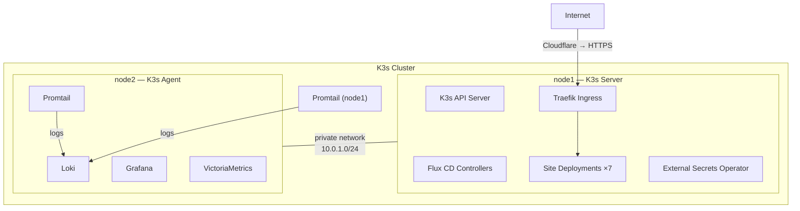
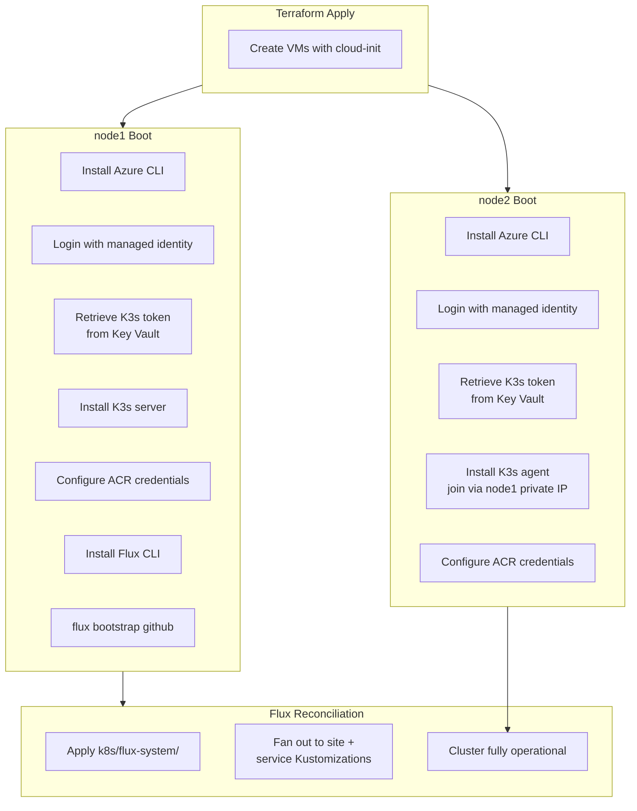
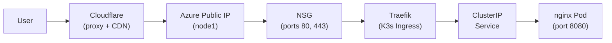

This platform runs on <a href="https://k3s.io/" target="_blank" rel="noopener noreferrer">K3s</a>, a lightweight Kubernetes distribution built by Rancher (now SUSE). K3s was selected as a deliberate architectural choice to keep infrastructure costs low while retaining the full Kubernetes feature set needed for production workloads.

## Why K3s?

### The Cost Problem

Managed Kubernetes services (AKS, EKS, GKE) are designed for large-scale workloads. Even at their smallest configurations, they impose a cost floor that is disproportionate for platforms like this one — a collection of static and near-static sites with modest traffic. The managed control plane, minimum node pool sizes, and associated networking resources (load balancers, NAT gateways) quickly add up.

### K3s as a Solution

K3s is a CNCF-certified Kubernetes distribution that passes the full Kubernetes conformance test suite. It supports the same APIs, the same manifests, and the same ecosystem of controllers and operators as any other Kubernetes distribution. The difference is in how it's packaged:

- **Single binary.** The entire K3s distribution — API server, scheduler, controller manager, kubelet, kube-proxy, and an embedded SQLite or etcd — ships as a single ~70MB binary.
- **Minimal resource footprint.** A K3s server node runs comfortably on 2 vCPUs and 4 GB of RAM. This platform runs its entire cluster on two `Standard_B2ms` VMs (2 vCPUs, 8 GB RAM each) — hardware that would serve as a single node in a managed cluster.
- **Batteries included.** K3s ships with Traefik as its default ingress controller, CoreDNS, and a local-path storage provisioner. These components work out of the box with no additional Helm charts or configuration.
- **No vendor lock-in.** Because K3s is fully conformance-tested, every manifest in this repository would work on AKS, EKS, or any other Kubernetes distribution without modification. The platform could migrate to a managed service if scale demanded it.

### What You Keep

K3s provides the full Kubernetes API, which means this platform uses the same tooling and patterns as any enterprise Kubernetes deployment:

| Capability | How It's Used |
|------------|---------------|
| Deployments, Services, Namespaces | Standard workload management — one namespace per site |
| Custom Resource Definitions | Flux CD Kustomizations, HelmReleases, External Secrets, Traefik IngressRoutes |
| RBAC | Managed identity integration for ACR pulls and Key Vault access |
| Helm controller | Flux manages Helm charts for Grafana, Loki, VictoriaMetrics, External Secrets |
| Ingress | Traefik IngressRoutes with TLS termination |
| Health probes | Liveness and readiness checks on every deployment |
| Resource limits | CPU and memory requests/limits on all containers |
| Node scheduling | Taints, tolerations, and node selectors for workload isolation |

### What You Save

Running K3s on two `Standard_B2ms` VMs instead of an equivalent managed Kubernetes cluster significantly reduces monthly costs:

| Component | Managed K8s (estimated) | K3s on VMs |
|-----------|------------------------|------------|
| Control plane | Included (free tier) or ~$70/mo | Embedded in VM |
| Minimum nodes | 2–3 nodes (~$100–150/mo) | 2 × Standard_B2ms (~$122/mo) |
| Load balancer | ~$20/mo | Cloudflare (free plan) |
| NAT gateway | ~$30/mo | Not needed |
| **Total** | **~$150–270/mo** | **~$122/mo** |

The cost savings come from three places: no separate control plane charge, smaller VMs (burstable B-series instead of general-purpose D-series), and Cloudflare replacing the need for a cloud load balancer.

## Cluster Topology



### Node Roles

The cluster uses a two-node architecture with deliberate workload separation:

**node1 (K3s server)** runs:

- The K3s control plane (API server, scheduler, controller manager)
- All seven site deployments
- Flux CD controllers (source-controller, kustomize-controller, helm-controller)
- Traefik ingress controller
- External Secrets Operator
- Promtail (log collection)

**node2 (K3s agent)** runs:

- Grafana dashboards
- Loki log aggregation
- VictoriaMetrics (metrics collection and storage)
- Promtail (log collection)

### Workload Isolation

Node2 is dedicated to the observability stack through Kubernetes taints and labels, configured at install time:

```bash
--node-taint observability=true:NoSchedule --node-label role=observability
```

This means:

- **No site workloads schedule on node2.** The `NoSchedule` taint prevents any pod without a matching toleration from being placed there.
- **Observability workloads target node2.** All Helm values for Grafana, Loki, VictoriaMetrics, and Promtail include `nodeSelector: { role: observability }` and a matching toleration.
- **Resource contention is eliminated.** Site traffic spikes on node1 cannot starve the monitoring stack, and observability ingestion on node2 cannot impact site response times.

## Cluster Bootstrap

The K3s cluster is fully automated — no manual SSH or `kubectl` commands are required after `terraform apply`. Both nodes are provisioned with cloud-init templates that execute on first boot.

### Bootstrap Sequence



### Shared Token via Key Vault

Both nodes need a shared K3s token to form the cluster. This is handled without any manual intervention:

1. Terraform generates a random 48-character token and stores it in Azure Key Vault
2. Both cloud-init scripts retrieve the token using their VM's managed identity
3. A retry loop (30 attempts, 10 seconds apart) handles the race condition where a VM may boot before the Key Vault secret is written

### ACR Authentication

K3s needs credentials to pull container images from Azure Container Registry. Since ACR doesn't support long-lived pull secrets for managed identities natively, a systemd timer handles credential rotation:

1. A shell script uses `az acr login --expose-token` to obtain a short-lived token
2. The token is written to `/etc/rancher/k3s/registries.yaml` in K3s's private registry format
3. K3s is restarted to pick up the new credentials
4. The timer runs every 2 hours; ACR tokens expire after 3 hours, so there is always a valid token

### Flux Bootstrap

After K3s is running on node1, the cloud-init script bootstraps Flux CD:

```bash
flux bootstrap github \
  --kubeconfig=/etc/rancher/k3s/k3s.yaml \
  --owner=DevOpsKev \
  --repository=kevin-ryan-platform \
  --branch=main \
  --path=k8s/flux-system \
  --personal \
  --token-auth \
  --components=source-controller,kustomize-controller,helm-controller
```

This single command connects the cluster to the Git repository and installs the Flux controllers. From this point on, all workload management is handled through GitOps — any manifest committed to `k8s/` is automatically applied to the cluster.

## Included Components

K3s ships with several components that this platform uses directly:

| Component | Role | Notes |
|-----------|------|-------|
| **Traefik** | Ingress controller | Handles TLS termination and routing for all sites and services |
| **CoreDNS** | Cluster DNS | Resolves internal service names (e.g. `loki.observability.svc.cluster.local`) |
| **Local-path provisioner** | Storage | Provides `PersistentVolumeClaim` storage for Loki and VictoriaMetrics |
| **Embedded SQLite** | K3s datastore | Stores cluster state (etcd replacement for single-server setups) |

## Networking

### Internal

Both nodes share a single Azure subnet (`10.0.1.0/24`). K3s uses its default VXLAN-based CNI (Flannel) to create a pod network overlay. Services communicate via ClusterIP within the cluster.

### External

Traffic flows through the following path:



Cloudflare proxies all traffic, providing CDN caching and DDoS protection. Traefik terminates TLS and routes requests to the correct service based on the hostname. The NSG allows HTTP/HTTPS from any source and SSH only from the admin IP.

### Private Database Access

The PostgreSQL Flexible Server lives on a separate delegated subnet (`10.0.2.0/28`) with a private DNS zone. Pods running on the K3s nodes can reach the database via the private FQDN, but no public internet access to the database exists.

## Scaling Considerations

The current two-node architecture is right-sized for this platform's workload. If needs change:

- **Vertical scaling** — change `var.vm_size` in Terraform to a larger SKU. No K3s or application changes needed.
- **Horizontal scaling** — add more agent nodes by calling the compute module again with a new cloud-init template joining the cluster. The existing Flux Kustomizations and Deployments will automatically schedule pods across the new capacity.
- **Migration to managed K8s** — since all manifests use standard Kubernetes APIs, the `k8s/` directory can be applied to AKS, EKS, or GKE with no changes. The only K3s-specific configuration is the cloud-init bootstrap, which would be replaced by the managed service's provisioning.

K3s makes it possible to start small and scale up without rearchitecting. The Kubernetes API is the abstraction boundary — everything above it (Flux, Helm charts, manifests, IngressRoutes) is portable.
