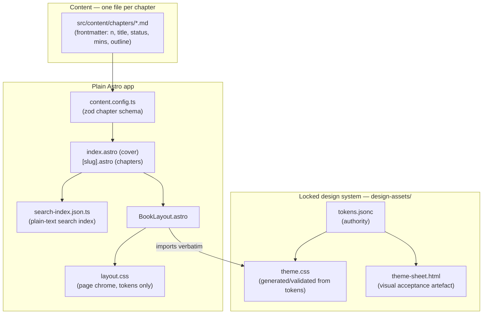

The *AI-Native Engineer* book site at <a href="https://ai-native-engineer.io" target="_blank" rel="noopener noreferrer">ai-native-engineer.io</a> is a statically exported **Astro 5** site — plain Astro, deliberately **no Starlight**. The book's design (cover, spine gauge, contents rail, chapter reader) is bespoke and locked, and Starlight's chrome would override it; Astro is used as a transparent HTML emitter so the canonical design system ships unchanged.

## Stack

| Technology | Version | Role |
|------------|---------|------|
| Astro | ^5.18.0 | Static site generation (plain — no Starlight) |
| TypeScript | ^5.9.0 | Type safety (strict, `astro check`) |
| Content Collections | Astro built-in | Chapter source of truth (markdown + zod schema) |
| nginx | 1.28.2-alpine | Static serving |
| Docker | node:22 → nginx two-stage | Build and serve |

## Architecture



## Content Model

A chapter is one markdown file in `src/content/chapters/` (13 files: `00-preface` … `12-next-five`). The frontmatter is the contract the layout reads — status lives in the content, not a separate manifest, so a chapter remains one file:

```yaml
n: "00"
title: Preface
status: live   # live | draft | plan — drives the status pill
mins: 6        # reading time
outline: []    # for chapters not yet written, fills the empty state
```

The zod schema in `src/content.config.ts` enforces this at build time.

## Locked Design System

`design-assets/` is the **locked source of truth** (THEME-SPEC.md v1.0.0):

- `tokens.jsonc` is the authority; `theme.css` is generated from or validated against it; `theme-sheet.html` is the visual acceptance artefact. **If the three disagree, `tokens.jsonc` wins and the others are rebuilt.**
- Nord palette as a fixed raw ramp, aliased by semantic tokens (`--accent`, `--ok`, `--warn`, `--danger`, `--info`, `--special`) — no component references a `nord*` value directly; `--accent` is the only interaction colour.
- Swiss grid, square corners, `data-theme` dark/light with distinct (not inverted) light values.
- `BookLayout` imports `theme.css` **verbatim**; page chrome lives in `src/styles/layout.css` and references tokens only. Generators read `tokens.jsonc`, never `theme.css`.
- Code figures are authored as raw `<figure class="code">` HTML with canonical `.tok-*` token spans — the theme owns their styling; chapters avoid fenced blocks so Shiki never runs.

## Build and Serve

Two-stage Docker build (mirroring the other static sites):

1. **Build stage** — node:22 Alpine with pnpm@10.33.2 runs `astro build`. `COMMIT_SHA`/`COMMIT_DATE` are injected as `PUBLIC_COMMIT_SHA`/`PUBLIC_COMMIT_DATE` env args, exposed via `import.meta.env` — the cover carries the exact commit the site was built from (the preface's "commit hash at the top of the page" promise).
2. **Serve stage** — nginx 1.28.2-alpine serves the static `dist/` output.

## Search

`src/pages/search-index.json.ts` is an Astro APIRoute that emits a static JSON index at build time: each entry carries the chapter's plain-text body (markdown and HTML stripped), consumed client-side for substring search. No search service, no runtime.

## Static-Export Compliance

The site follows the repo-wide static constraints: no server-side runtime dependencies, fully static output, TypeScript strict mode. Its React component constraints do not apply — there are no React components; the UI is Astro components (`Cover`, `ChapterReader`, `ContentsRail`, `Gauge`, `OnPage`, `Pill`, `Search`, `TopRail`) plus one client script (`src/scripts/reader.ts`).
