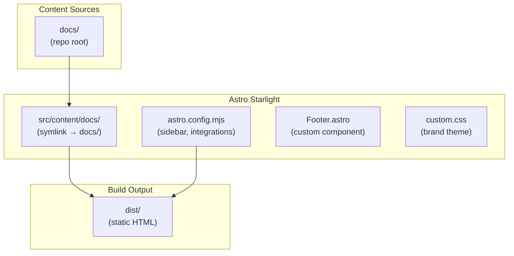

The documentation site at <a href="https://docs.kevinryan.io" target="_blank" rel="noopener noreferrer">docs.kevinryan.io</a> hosts all platform documentation and Architecture Decision Records. It is built with Astro Starlight and served by nginx.

## Stack

| Technology | Version | Role |
|------------|---------|------|
| Astro | ^5 | Static site generator |
| @astrojs/starlight | ^0.34 | Documentation theme |
| Mermaid | ^11.12.3 | Diagram rendering |
| astro-mermaid | ^1 | Astro integration for Mermaid |
| sharp | ^0.33 | Image optimisation |

## Architecture



## Content Structure

The docs site pulls its content from the repo root via a single symlink chain:

```text
1. `sites/docs-kevinryan-io/src/content/docs/` → `../../../../docs/` (content lives at repo root)
```

This means documentation is editable from the repo root (`docs/`) and automatically appears in the built site.

## Configuration

### Astro Config (`astro.config.mjs`)

| Setting | Value |
|---------|-------|
| Site URL | `https://docs.kevinryan.io` |
| Title | Kevin Ryan — Docs |
| Integrations | astro-mermaid, Starlight |
| Custom CSS | `./src/styles/custom.css` |
| Custom components | Footer (commit SHA display) |
| Analytics | Umami script injected via `head` config |

### Starlight Sidebar

The sidebar is manually configured with a mix of direct links and auto-generated sections:

- Direct links for platform documentation pages
- `autogenerate` for the ADR directory (auto-discovers new `.md` files)

### Content Config (`src/content.config.ts`)

Uses Starlight's `docsLoader()` and `docsSchema()` to define a single `docs` content collection covering all markdown files under `src/content/docs/`.

## Styling

The site uses a custom dark theme that overrides Starlight defaults:

| Element | Value |
|---------|-------|
| Accent colour | `#A8E10C` (brand green) |
| Display font | Bebas Neue |
| Body font | Archivo |
| Code font | JetBrains Mono |
| Theme | Dark only (light theme selector hidden) |

## Custom Components

### Footer (`src/components/Footer.astro`)

A custom Astro component that replaces Starlight's default footer. It displays the `PUBLIC_COMMIT_SHA` environment variable, linking each page to the exact commit that produced it.

## Build and Serve

The site uses a multi-stage Docker build with special handling for the content symlink:

1. **Build stage** — Node.js 22 Alpine with pnpm:
   - Copies `docs/` from the monorepo root
   - Copies the site source
   - Replaces the `src/content/docs` symlink with real content via `cp -rL` (Docker `COPY` does not follow symlinks pointing outside the copied tree)
   - Runs `astro build` producing `dist/`

1. **Serve stage** — nginx 1.28.2 Alpine serves the static output on port 8080

### nginx Configuration

- JSON structured access logs
- Gzip compression
- Long-lived cache for static assets (`.css`, `.js`, `.svg`, `.png`, `.ico`, `.woff2`)
- No-cache for HTML
- `/healthz` endpoint for Kubernetes probes
- Security headers
- `try_files` fallback to `/404.html`
