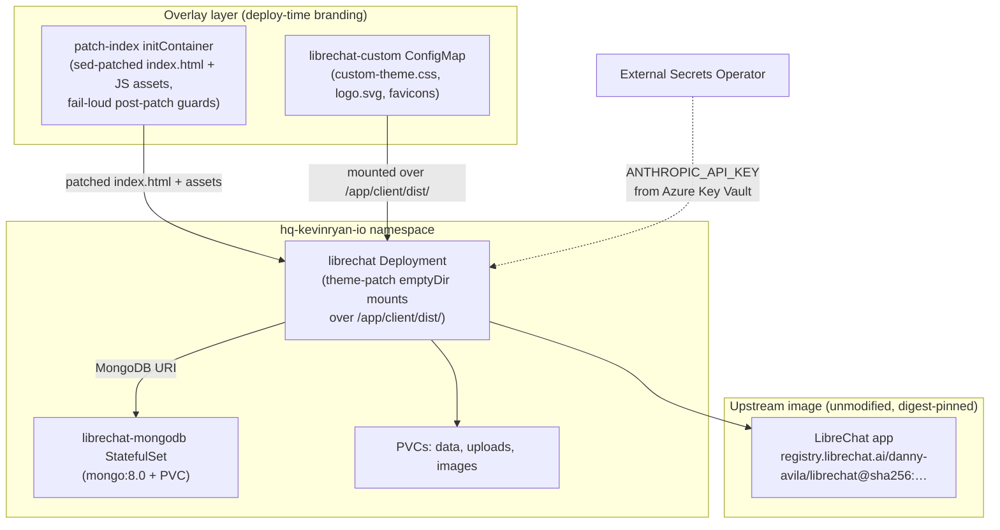

The HQ site at <a href="https://hq.kevinryan.io" target="_blank" rel="noopener noreferrer">hq.kevinryan.io</a> is an internal AI chat workspace built on **upstream, unmodified LibreChat**. It is the deliberate exception to every static-site constraint in this repository: there is no build step, no Dockerfile, and no committed application source. All branding is applied as an **overlay layer** at deploy time, on top of the digest-pinned upstream image. The architecture and its trade-offs are decided in [ADR-023](/adr/adr-023-librechat-theme-overlay/).

## Stack

| Technology | Version | Role |
|------------|---------|------|
| LibreChat | upstream image, digest-pinned (`sha256:c5db3331…`) | Chat application (pre-built upstream image, pulled direct — never built here) |
| MongoDB | 8.0 | Chat/data store (internal StatefulSet, not Azure PostgreSQL) |
| Kubernetes | — | Deployment, StatefulSet, IngressRoute, PVCs, ConfigMaps |
| Flux CD | — | GitOps reconciliation from `k8s/hq-kevinryan-io/` |
| External Secrets Operator | — | Syncs `librechat-secrets` from Azure Key Vault |

There is no build toolchain for this site — no Next.js, no Astro, no pnpm scripts. The repo deliberately contains **manifests and overlay sources only**.

## Architecture

## Deployment Reality

Everything runs in the `hq-kevinryan-io` namespace, managed by Flux from `k8s/hq-kevinryan-io/`:

| Resource | Notes |
|----------|-------|
| `librechat` Deployment | 1 replica; initContainer + container use the **same digest-pinned image** |
| `librechat-mongodb` StatefulSet + Service | `mongo:8.0`, own PVC — internal to the namespace, not Azure PostgreSQL |
| PVCs | `librechat-data`, `librechat-uploads`, `librechat-images` (logs/skill are emptyDirs) |
| `librechat-config` ConfigMap | App config incl. the Claude model list |
| `librechat-custom` ConfigMap | Theme overlay assets — generated by `scripts/sync-hq-theme.sh` |
| `librechat-secrets` ExternalSecret | Synced from Azure Key Vault via the `ClusterSecretStore` |
| IngressRoute | Traefik TLS for `hq.kevinryan.io` |

Health probes are `httpGet /health` (verified on the pinned digest — re-verify whenever the digest is bumped). The shared CI deploy workflow **auto-skips** this site because it has no Dockerfile; changes deploy via Flux on push to `main` only.

## The Theme Overlay Layer

All branding — Tokyo Night Moon dark-only theme, "HQ - Kevin Ryan & Associates" title, kevinryan.io favicons, transparent login logo, patched login heading — is applied at deploy time, never baked into an image:

1. **`patch-index` initContainer** copies the image's `index.html` and `assets/` into an `emptyDir`, then `sed`s in the theme stylesheet link, the branded title, Tokyo Night Moon loading-screen colors, dark-mode forcing, and the en-locale login heading in the compiled JS bundle.
2. **Fail-loud guards** follow every patch: if any post-condition is missing (upstream changed the `index.html` shape), the initContainer exits 1 and the rollout blocks — the site never silently deploys unthemed.
3. **`librechat-custom` ConfigMap** mounts `custom-theme.css`, `logo.svg`, and favicons over `/app/client/dist/`.
4. **Cache busting is content-derived**: the CSS `?v=` is the first 8 hex of `sha256(custom-theme.css)`; the JS asset `?v=` is the hash of the patched bundle — so the service worker precache busts exactly when content changes. Precompressed `.br`/`.gz` siblings of the patched JS are deleted so the patched file is what gets served.

The overlay sources live in `sites/hq-kevinryan-io/` (`custom-theme.css`, `logo.svg`, favicons); `scripts/sync-hq-theme.sh` regenerates the ConfigMap from them, and `validate.yml` runs it in `--check` mode on every push to block drift between sources and the deployed ConfigMap.

> Any change to this layer — theming, branding, or a LibreChat image digest bump — must follow the `patch-librechat-theme` skill (`.pi/skills/`), including the mandatory throwaway-pod guard test before any image bump. Never edit the generated ConfigMap by hand.

## Authentication and AI Endpoints

- **Auth**: LibreChat native email/password. The Auth0/GitHub OAuth layer from [ADR-021](/adr/adr-021-auth0-authentication-hq/) was dropped in the re-platform to vanilla LibreChat — ADR-021 is superseded by [ADR-023](/adr/adr-023-librechat-theme-overlay/).
- **Claude endpoint**: enabled via `ANTHROPIC_API_KEY`, synced from Azure Key Vault by External Secrets Operator. The model list (Opus/Sonnet/Haiku 4–5 families) is set in `librechat-config`.

## Exception Status

hq.kevinryan.io is the one site excluded from the repo's static-export and zero-runtime constraints:

- No static export (server-side Node app + MongoDB)
- No build step, no Dockerfile, no committed app source — CI deploy auto-skips it
- No TypeScript/React/Tailwind conventions apply (there is no first-party frontend code)
- Upstream updates are **deliberate, gated manual changes** (digest bump + guard test), not CI-pushed builds

The trade-off is explicit in ADR-023: zero build maintenance in exchange for an overlay that is brittle to upstream UI changes — with the brittleness converted into loud, blocking failures (rollout guards, CI drift checks, pre-bump guard tests).

## References

- [ADR-023: LibreChat Theming via Overlay on Upstream Image](/adr/adr-023-librechat-theme-overlay/)
- [ADR-021: Auth0 for HQ Authentication](/adr/adr-021-auth0-authentication-hq/) (superseded)
- `k8s/hq-kevinryan-io/` — deployment, statefulset, ingress, secrets
- `scripts/sync-hq-theme.sh` — theme ConfigMap generator (+ `--check` drift gate)
- `.pi/skills/patch-librechat-theme/SKILL.md` — mandatory procedure for theming changes and image bumps
