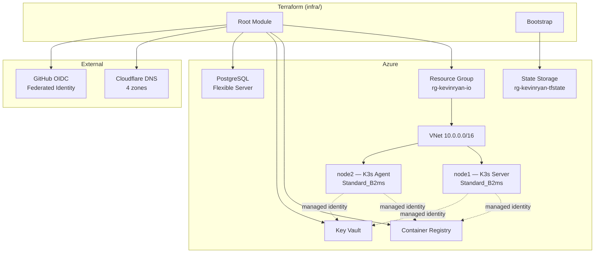
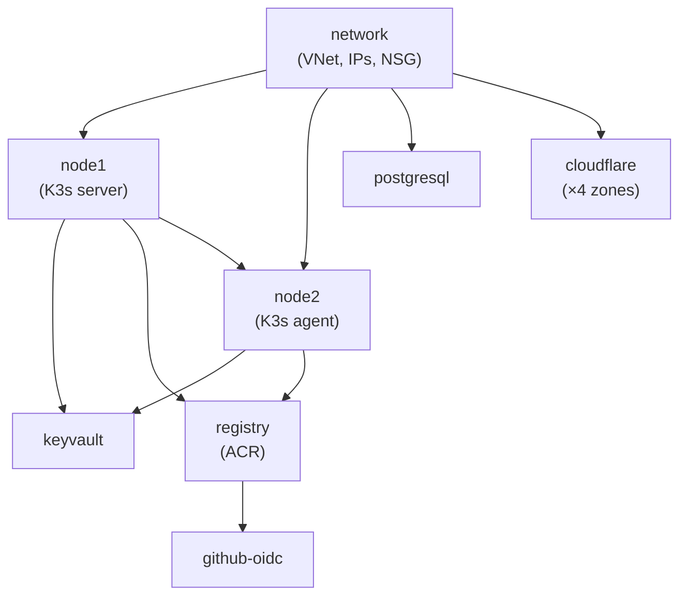

All infrastructure for this platform is defined as code in the `infra/` directory using <a href="https://www.terraform.io/" target="_blank" rel="noopener noreferrer">Terraform</a>. A push to `main` that changes files under `infra/` triggers the Terraform workflow (plan + manual approval + apply).

## Architecture Overview



## Module Structure

The infrastructure is broken into seven reusable modules, orchestrated by a root module:

```text
infra/
├── main.tf                    # Root orchestration, providers, backend
├── variables.tf               # Root input variables
├── outputs.tf                 # Root outputs (IPs, ACR, OIDC values)
├── cloud-init-server.yaml     # K3s server bootstrap template
├── cloud-init-agent.yaml      # K3s agent bootstrap template
├── bootstrap/                 # State backend bootstrap (run once)
│   └── main.tf
└── modules/
    ├── network/               # VNet, subnet, NSG, public IPs
    ├── compute/               # Linux VM with managed identity
    ├── registry/              # Azure Container Registry + AcrPull
    ├── keyvault/              # Key Vault with RBAC
    ├── postgresql/            # Flexible Server, private subnet, databases
    ├── cloudflare/            # DNS records + cache rules
    └── github-oidc/           # Azure AD app + federated credentials
```

## Providers

| Provider | Version | Purpose |
|----------|---------|---------|
| `azurerm` | `~> 4.0` | Azure resources (VMs, VNet, ACR, Key Vault, PostgreSQL) |
| `azuread` | `~> 3.0` | Azure AD application and service principal for OIDC |
| `cloudflare` | `~> 4.0` | DNS records and cache rules |
| `random` | `~> 3.0` | Password generation for K3s token, PostgreSQL, Umami, Grafana |

## State Backend

Terraform state is stored remotely in Azure Blob Storage:

| Setting | Value |
|---------|-------|
| Resource group | `rg-kevinryan-tfstate` |
| Storage account | `krtfstate2026` |
| Container | `tfstate` |
| Key | `kevinryan-io.tfstate` |
| Versioning | Enabled |

The bootstrap module (`infra/bootstrap/`) creates this storage account as a one-time setup:

```hcl
resource "azurerm_resource_group" "tfstate" {
  name     = "rg-kevinryan-tfstate"
  location = "northeurope"
}

resource "azurerm_storage_account" "tfstate" {
  name                     = var.storage_account_name
  resource_group_name      = azurerm_resource_group.tfstate.name
  location                 = azurerm_resource_group.tfstate.location
  account_tier             = "Standard"
  account_replication_type = "LRS"

  blob_properties {
    versioning_enabled = true
  }
}

resource "azurerm_storage_container" "tfstate" {
  name                  = "tfstate"
  storage_account_id    = azurerm_storage_account.tfstate.id
  container_access_type = "private"
}
```

## Network Module

Creates the foundational Azure networking layer.

| Resource | Name | Details |
|----------|------|---------|
| Resource Group | `rg-kevinryan-io` | All resources live here |
| Virtual Network | `vnet-kevinryan-io` | `10.0.0.0/16` address space |
| Subnet | `snet-kevinryan-io` | `10.0.1.0/24` for VMs |
| Public IP (node1) | `pip-kevinryan-io` | Static, Standard SKU, Zone 1 |
| Public IP (node2) | `pip-kevinryan-node2` | Static, Standard SKU, Zone 1 |
| NSG | `nsg-kevinryan-io` | Inbound rules below |

### NSG Rules

| Priority | Name | Port | Source |
|----------|------|------|--------|
| 100 | AllowHTTP | 80 | Any |
| 110 | AllowHTTPS | 443 | Any |
| 120 | AllowSSH | 22 | Admin IP only |

SSH is restricted to a single admin IP address (passed via `var.admin_ip`), while HTTP and HTTPS are open to the internet for Cloudflare-proxied traffic.

## Compute Module

Creates Ubuntu Linux VMs with system-assigned managed identities. The module is called twice — once for the K3s server node and once for the agent node.

| Setting | Value |
|---------|-------|
| OS | Ubuntu 24.04 LTS (`Canonical/ubuntu-24_04-lts/server`) |
| Size | `Standard_B2ms` (2 vCPUs, 8 GB RAM) |
| Disk | 30 GB Standard LRS |
| Zone | 1 |
| Identity | System-assigned managed identity |

Each VM receives a cloud-init template at creation time that bootstraps the K3s cluster. The `custom_data` lifecycle is set to `ignore_changes` so Terraform doesn't recreate VMs when the cloud-init template changes.

### Cloud-Init: K3s Server (node1)

The server node's cloud-init performs:

1. Install Azure CLI and authenticate with managed identity
2. Retrieve the K3s token from Key Vault (with retry loop — up to 5 minutes)
3. Install K3s in server mode
4. Set up ACR credential refresh (systemd timer, every 2 hours)
5. Install Flux CLI and bootstrap Flux CD from the GitHub repository

```yaml
# Key excerpt from cloud-init-server.yaml
- |
  export GITHUB_TOKEN="${github_token}"
  flux bootstrap github \
    --kubeconfig=/etc/rancher/k3s/k3s.yaml \
    --owner=kevin-ryan-associates \
    --repository=kra-platform \
    --branch=main \
    --path=k8s/flux-system \
    --personal \
    --token-auth \
    --components=source-controller,kustomize-controller,helm-controller
```

### Cloud-Init: K3s Agent (node2)

The agent node's cloud-init performs:

1. Install Azure CLI and authenticate with managed identity
2. Retrieve the K3s token from Key Vault (with retry loop)
3. Install K3s in agent mode, joining the server via its private IP
4. Set up ACR credential refresh (systemd timer, every 2 hours)

The agent node is configured with a taint and label for observability workloads:

```bash
INSTALL_K3S_EXEC="--node-taint observability=true:NoSchedule --node-label role=observability"
```

This ensures the observability stack (Grafana, Loki, VictoriaMetrics) is scheduled exclusively on node2, keeping site workloads isolated on node1.

### ACR Credential Refresh

Both nodes run a systemd timer that refreshes ACR authentication every 2 hours. ACR tokens expire after 3 hours, so the 2-hour interval ensures continuity. The script uses Azure CLI with the VM's managed identity to obtain a fresh token and writes it to the K3s registries configuration:

```yaml
mirrors:
  "<acr>.azurecr.io":
    endpoint:
      - "https://<acr>.azurecr.io"
configs:
  "<acr>.azurecr.io":
    auth:
      username: "00000000-0000-0000-0000-000000000000"
      password: "<token>"
```

### Circular Dependency Resolution

There is a potential circular dependency: the Key Vault module needs VM principal IDs (to grant RBAC), and the cloud-init templates need the Key Vault name (to retrieve secrets). This is resolved by passing the Key Vault name as a root-level variable (`var.keyvault_name`) rather than referencing the module output, breaking the Terraform dependency cycle.

## Registry Module

Creates an Azure Container Registry and grants `AcrPull` to both VM managed identities:

| Setting | Value |
|---------|-------|
| SKU | Basic |
| Admin enabled | No |
| Role assignments | `AcrPull` for node1 and node2 |

GitHub Actions pushes images via the `AcrPush` role (granted by the github-oidc module). VMs pull images via `AcrPull` using their managed identities.

## Key Vault Module

Creates an Azure Key Vault with RBAC authorization (no access policies):

| Setting | Value |
|---------|-------|
| SKU | Standard |
| RBAC enabled | Yes |
| Purge protection | Disabled |

### Role Assignments

| Principal | Role | Purpose |
|-----------|------|---------|
| node1 + node2 (managed identity) | Key Vault Secrets User | Read secrets at runtime via External Secrets Operator |
| Terraform caller | Key Vault Secrets Officer | Create and manage secrets during `terraform apply` |

### Managed Secrets

Terraform generates and stores these secrets in Key Vault:

| Secret | Source | Consumer |
|--------|--------|----------|
| `k3s-token` | `random_password` (48 chars) | Cloud-init on both nodes |
| `pg-admin-password` | `random_password` (32 chars) | PostgreSQL, External Secrets |
| `pg-fqdn` | PostgreSQL module output | External Secrets |
| `pg-admin-username` | PostgreSQL module output | External Secrets |
| `umami-app-secret` | `random_password` (64 chars) | External Secrets → Umami |
| `grafana-admin-password` | `random_password` (32 chars) | External Secrets → Grafana |

## PostgreSQL Module

Provisions an Azure Database for PostgreSQL Flexible Server on a private subnet:

| Setting | Value |
|---------|-------|
| SKU | `B_Standard_B1ms` (burstable, 1 vCore, 2 GB RAM) |
| Version | PostgreSQL 16 |
| Storage | 32 GB (auto-grow enabled) |
| Backup | 7-day retention, no geo-redundancy |
| Network | Private subnet `10.0.2.0/28`, private DNS zone |
| Public access | Disabled |
| Extensions | `PGCRYPTO` (required by Umami) |

### Databases

| Database | Charset | Collation | Consumer |
|----------|---------|-----------|----------|
| `umami_db` | UTF8 | `en_US.utf8` | Umami analytics |
| `grafana_db` | UTF8 | `en_US.utf8` | Grafana |

### Private Networking

The PostgreSQL server is deployed to a delegated subnet (`snet-postgresql`) with a private DNS zone (`privatelink.postgres.database.azure.com`) linked to the VNet. This means the database is only accessible from within the VNet — no public internet exposure.

## Cloudflare Module

Manages DNS records and cache rules for each domain. The module is called once per domain zone:

| Domain | Zone Variable | Subdomains |
|--------|---------------|------------|
| `kevinryan.io` | `cloudflare_zone_id` | `brand`, `docs` |
| `aiimmigrants.com` | `cloudflare_zone_id_aiimmigrants` | — |
| `distributedequity.org` | `cloudflare_zone_id_distributedequity` | — |

Additionally, `analytics` and `monitoring` A records are created directly in the root module for `analytics.kevinryan.io` and `monitoring.kevinryan.io`.

### DNS Records per Domain

For each domain, the module creates:

- **Root (`@`)** — A record pointing to node1's public IP, Cloudflare proxied
- **`www`** — A record pointing to node1's public IP, Cloudflare proxied
- **Subdomains** — A records for each entry in the `subdomains` list

All records are proxied through Cloudflare (orange cloud), providing DDoS protection and CDN caching.

### Cache Rules

Each domain gets a Cloudflare ruleset in the `http_request_cache_settings` phase:

- **Edge TTL:** 86,400 seconds (24 hours), overriding origin headers
- **Serve stale:** Enabled — Cloudflare serves cached content if the origin is down

This is applied to all hostnames for the domain (root, www, and subdomains) via a dynamically constructed expression.

## GitHub OIDC Module

Configures passwordless authentication between GitHub Actions and Azure using OpenID Connect:

### Azure AD Resources

| Resource | Name |
|----------|------|
| Application | `github-actions-kevinryan-io` |
| Service Principal | Created from the application |

### Federated Identity Credentials

| Credential | Subject |
|------------|---------|
| `main-branch` | `repo:kevin-ryan-associates/kra-platform:ref:refs/heads/main` |
| `production-env` | `repo:kevin-ryan-associates/kra-platform:environment:production` |

The `main-branch` credential allows deploy workflows to authenticate. The `production-env` credential allows the Terraform apply job (which runs in the `production` GitHub environment) to authenticate.

### Role Assignments

| Scope | Role | Purpose |
|-------|------|---------|
| ACR | `AcrPush` | Push Docker images from CI |
| Resource group | `Contributor` | Manage resources during Terraform apply |
| State storage account | `Storage Blob Data Contributor` | Read/write Terraform state |
| State resource group | `Reader` | `terraform init` reads storage account properties |

## Outputs

The root module exports values needed for GitHub Actions configuration:

| Output | Description |
|--------|-------------|
| `github_actions_client_id` | `AZURE_CLIENT_ID` secret for workflows |
| `github_actions_tenant_id` | `AZURE_TENANT_ID` secret for workflows |
| `github_actions_subscription_id` | `AZURE_SUBSCRIPTION_ID` secret for workflows |
| `github_actions_acr_name` | `ACR_NAME` secret for workflows |
| `github_actions_acr_login_server` | `ACR_LOGIN_SERVER` secret for workflows |
| `node1_public_ip` | Public IP of the K3s server node |
| `node2_public_ip` | Public IP of the K3s agent node |
| `postgresql_fqdn` | FQDN of the PostgreSQL Flexible Server |

## Dependency Graph

The module dependency order during `terraform apply`:



The `node1 → node2` dependency exists because the agent's cloud-init references `module.node1.private_ip_address` to join the K3s cluster.
