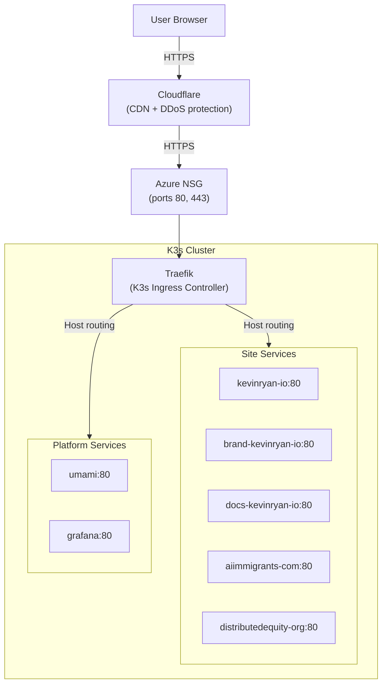
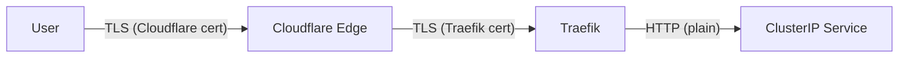

<a href="https://traefik.io/traefik/" target="_blank" rel="noopener noreferrer">Traefik</a> is the ingress controller for this platform. It ships as the default ingress controller with K3s and handles all inbound HTTPS traffic — routing requests to the correct Kubernetes service based on hostname, terminating TLS, and providing automatic certificate management.

## Why Traefik?

Traefik was not explicitly chosen — it comes bundled with K3s. However, it is a natural fit for this platform:

- **Zero configuration.** K3s installs and configures Traefik automatically. No Helm chart, no custom values, no additional manifests are needed for the controller itself.
- **CRD-native routing.** Traefik's `IngressRoute` CRD provides more expressive routing than the standard Kubernetes `Ingress` resource, including native support for host matching, path rules, middleware chains, and TLS configuration.
- **Automatic TLS.** Traefik integrates with Let's Encrypt out of the box for automatic certificate provisioning and renewal. In this platform, Cloudflare handles TLS at the edge, so Traefik terminates TLS between Cloudflare and the cluster.
- **Low resource footprint.** Traefik runs as a single pod on node1, consuming minimal CPU and memory — consistent with the platform's cost-effective approach.

## Traffic Flow



1. The user's browser connects to Cloudflare over HTTPS
2. Cloudflare proxies the request to the Azure public IP (node1) over HTTPS
3. The NSG allows traffic on ports 80 and 443
4. Traefik receives the request, matches the `Host` header against its IngressRoute rules, and forwards to the correct ClusterIP service
5. The service routes to the nginx pod on port 8080

## IngressRoute Configuration

Every site and service uses a Traefik `IngressRoute` CRD (`traefik.io/v1alpha1`). All follow the same pattern:

```yaml
apiVersion: traefik.io/v1alpha1
kind: IngressRoute
metadata:
  name: <site-name>
  namespace: <site-name>
spec:
  entryPoints:
    - websecure
  routes:
    - match: Host(`<domain>`) || Host(`www.<domain>`)
      kind: Rule
      services:
        - name: <site-name>
          port: 80
  tls: {}
```

### Key Elements

| Field | Value | Purpose |
|-------|-------|---------|
| `entryPoints` | `websecure` | Listen on the HTTPS port (443) only |
| `match` | `Host(...)` | Route based on the HTTP `Host` header |
| `services.port` | `80` | Forward to the ClusterIP service on port 80 |
| `tls: {}` | Empty object | Enable TLS termination with default certificate |

### Route Inventory

All ten IngressRoutes in the cluster:

| IngressRoute | Namespace | Host Match | Service |
|-------------|-----------|------------|---------|
| `kevinryan-io` | `kevinryan-io` | `kevinryan.io` \|\| `www.kevinryan.io` | `kevinryan-io:80` |
| `brand-kevinryan-io` | `brand-kevinryan-io` | `brand.kevinryan.io` | `brand-kevinryan-io:80` |
| `docs-kevinryan-io` | `docs-kevinryan-io` | `docs.kevinryan.io` | `docs-kevinryan-io:80` |
| `aiimmigrants-com` | `aiimmigrants-com` | `aiimmigrants.com` \|\| `www.aiimmigrants.com` | `aiimmigrants-com:80` |
| `distributedequity-org` | `distributedequity-org` | `distributedequity.org` \|\| `www.distributedequity.org` | `distributedequity-org:80` |
| `ai-native-engineer-io` | `ai-native-engineer-io` | `ai-native-engineer.io` \|\| `www.ai-native-engineer.io` | `ai-native-engineer-io:80` |
| `librechat` | `hq-kevinryan-io` | `hq.kevinryan.io` | `librechat:80` |
| `directus` | `directus` | `dam.kevinryan.io` | `directus:80` |
| `umami` | `umami` | `analytics.kevinryan.io` | `umami:80` |
| `grafana` | `observability` | `monitoring.kevinryan.io` | `grafana:80` |

### Host Matching Patterns

Sites use two patterns:

- **Apex + www** — most sites match both the bare domain and `www` subdomain: `Host('example.com') || Host('www.example.com')`. This ensures users reach the site regardless of whether they include `www`.
- **Subdomain only** — subdomains like `brand.kevinryan.io`, `docs.kevinryan.io`, `analytics.kevinryan.io`, and `monitoring.kevinryan.io` match a single hostname since `www` subdomains of subdomains are not used.

## TLS Termination

Every IngressRoute specifies `tls: {}` with an empty configuration object. This delegates certificate management to Traefik's default TLS resolver.

### Cloudflare + Traefik TLS Model

The TLS chain in this platform has two layers:



| Segment | TLS | Certificate |
|---------|-----|-------------|
| User → Cloudflare | Yes | Cloudflare-issued (managed automatically) |
| Cloudflare → Traefik | Yes | Traefik default certificate (self-signed or Let's Encrypt) |
| Traefik → Service | No | Plain HTTP within the cluster network |

Cloudflare's SSL/TLS mode is set to "Full", meaning Cloudflare connects to the origin (Traefik) over HTTPS but does not require a valid CA-signed certificate. This allows Traefik to use its default self-signed certificate for the Cloudflare-to-origin segment while Cloudflare handles the trusted certificate presented to end users.

## Namespace Isolation

Each IngressRoute lives in the same namespace as the service it routes to. This is a deliberate design choice:

- **No cross-namespace routing.** Each site's ingress configuration is self-contained within its namespace, managed by the same Flux Kustomization as the site's deployment and service.
- **Independent lifecycle.** Adding, removing, or modifying a site's routing does not touch any shared configuration. The IngressRoute is just another manifest in `k8s/<site-name>/`.
- **Least privilege.** Flux's `prune: true` setting means removing a site's directory from `k8s/` automatically removes its IngressRoute, service, deployment, and namespace — a clean teardown with no orphaned routes.

## Entry Points

K3s configures Traefik with two default entry points:

| Entry Point | Port | Protocol | Used By |
|-------------|------|----------|---------|
| `web` | 80 | HTTP | Not used (no HTTP-only routes defined) |
| `websecure` | 443 | HTTPS | All IngressRoutes |

All IngressRoutes in this platform use `websecure` exclusively. HTTP traffic on port 80 is handled by Traefik's default HTTP-to-HTTPS redirect, ensuring all requests are upgraded to TLS.

## Service Mesh

Traefik routes to standard Kubernetes `ClusterIP` services. The service-to-pod mapping is straightforward:

```yaml
apiVersion: v1
kind: Service
metadata:
  name: <site-name>
  namespace: <site-name>
spec:
  selector:
    app: <site-name>
  ports:
    - port: 80
      targetPort: 8080
```

Every service maps port 80 (what Traefik connects to) to port 8080 (what the nginx container listens on). The only exception is Umami, which maps port 80 to port 3000 (its Node.js server), and Grafana, which also exposes port 80.

## Adding a Route for a New Site

To add Traefik routing for a new site:

1. Create `k8s/<site-name>/ingress.yaml`:

```yaml
apiVersion: traefik.io/v1alpha1
kind: IngressRoute
metadata:
  name: <site-name>
  namespace: <site-name>
spec:
  entryPoints:
    - websecure
  routes:
    - match: Host(`<domain>`) || Host(`www.<domain>`)
      kind: Rule
      services:
        - name: <site-name>
          port: 80
  tls: {}
```

1. Ensure the corresponding `service.yaml` exists in the same directory with a selector matching the deployment's pod labels.

1. Add DNS records in Terraform (Cloudflare module) pointing the domain to the cluster's public IP.

1. Merge to `main`. Flux applies the IngressRoute and Traefik begins routing traffic to the new service within the reconciliation interval.

No Traefik restart or reconfiguration is needed — it watches for IngressRoute CRDs and updates its routing table dynamically.
