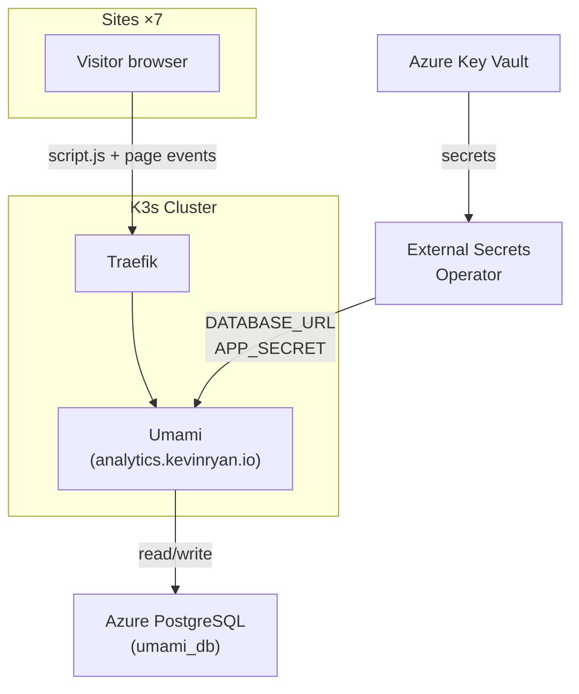

This platform uses <a href="https://umami.is/" target="_blank" rel="noopener noreferrer">Umami</a>, a self-hosted, privacy-focused web analytics tool, to track visitor activity across all seven sites. Umami is deployed as a Kubernetes workload within the cluster, backed by Azure PostgreSQL, and accessible at <a href="https://analytics.kevinryan.io" target="_blank" rel="noopener noreferrer">analytics.kevinryan.io</a>.

## Why Umami?

Umami was selected over third-party analytics services for several reasons:

- **Privacy by design.** Umami does not use cookies, does not collect personal data, and does not track users across sites. This means no cookie consent banners are needed and the platform complies with GDPR, CCPA, and similar regulations without configuration.
- **Self-hosted.** All analytics data stays within the platform's own infrastructure — on the K3s cluster and Azure PostgreSQL database. No data is sent to third parties.
- **Lightweight.** The tracking script (`script.js`) is ~2KB. It has no impact on page load performance and does not block rendering.
- **No sampling.** Every page view is recorded. There is no data sampling or aggregation that loses fidelity at low traffic volumes.
- **Open source.** Umami is MIT-licensed with an active community. There is no vendor lock-in or pricing tier to outgrow.

## Tracking Integration

Every site in the platform includes the Umami tracking script. Each site has a unique website ID that maps to a distinct property in the Umami dashboard.

### Website IDs

| Site | Domain | Website ID |
|------|--------|------------|
| Portfolio | kevinryan.io | `155819eb-1dde-475a-95ed-9bc0b1b161b6` |
| Brand Guidelines | brand.kevinryan.io | `c41e7b1b-81ea-422d-ba9b-9ac2e73f2192` |
| Docs | docs.kevinryan.io | `7982fbc0-012b-4c04-8ec3-a9de42462351` |
| AI Immigrants | aiimmigrants.com | `c9c48aa2-f7c6-495f-bbed-5837392834ba` |
| Distributed Equity | distributedequity.org | `0b17c94d-4711-4454-9c5b-ea437abaaf87` |
| The AI-Native Engineer | ai-native-engineer.io | `38d895e8-552c-4dc8-a3f0-a493d49d75e2` |

> aiimmigrants.com and distributedequity.org have Umami websites registered but currently ship no tracking script — the IDs above are provisional until tracking is added (see the follow-up work item).

### Script Snippet

The tracking script is identical across all sites — only the `data-website-id` changes:

```html
<script defer src="https://analytics.kevinryan.io/script.js"
        data-website-id="<website-id>"></script>
```

The `defer` attribute ensures the script loads without blocking page rendering.

### Integration by Site Type

**Next.js (kevinryan.io)** — uses the `next/script` component in the root layout with `strategy="afterInteractive"`:

```tsx
<Script
  src="https://analytics.kevinryan.io/script.js"
  data-website-id="155819eb-1dde-475a-95ed-9bc0b1b161b6"
  strategy="afterInteractive"
/>
```

**Astro Starlight (docs.kevinryan.io)** — injected via the Starlight `head` config in `astro.config.mjs`:

```javascript
head: [
  {
    tag: 'script',
    attrs: {
      defer: true,
      src: 'https://analytics.kevinryan.io/script.js',
      'data-website-id': '7982fbc0-012b-4c04-8ec3-a9de42462351',
    },
  },
],
```

**Static HTML sites** — a plain `<script>` tag before the closing `</body>`:

```html
<script defer src="https://analytics.kevinryan.io/script.js"
        data-website-id="c41e7b1b-81ea-422d-ba9b-9ac2e73f2192"></script>
```

**Astro plain (ai-native-engineer.io)** — a `<script>` tag in the layout `<head>`, since this site uses a custom layout rather than Starlight's `head` config:

```html
<script defer src="https://analytics.kevinryan.io/script.js"
        data-website-id="38d895e8-552c-4dc8-a3f0-a493d49d75e2"></script>
```

## Architecture



### Data Flow

1. A visitor loads any site page. The browser fetches `script.js` from `analytics.kevinryan.io`.
2. The script sends page view events (URL, referrer, browser, OS, screen size, language) to the Umami API. No cookies are set. No personal data is collected.
3. Umami writes the event to the `umami_db` PostgreSQL database.
4. The Umami dashboard reads from the same database to display real-time and historical analytics.

## Kubernetes Deployment

Umami runs in its own namespace with five manifests managed by Flux CD.

### Namespace

```yaml
apiVersion: v1
kind: Namespace
metadata:
  name: umami
```

### Deployment

A single replica running the official Umami PostgreSQL image:

```yaml
apiVersion: apps/v1
kind: Deployment
metadata:
  name: umami
  namespace: umami
spec:
  replicas: 1
  selector:
    matchLabels:
      app: umami
  template:
    metadata:
      labels:
        app: umami
    spec:
      containers:
        - name: umami
          image: ghcr.io/umami-software/umami:postgresql-latest
          ports:
            - containerPort: 3000
          envFrom:
            - secretRef:
                name: umami-db
          env:
            - name: DISABLE_TELEMETRY
              value: "1"
          livenessProbe:
            httpGet:
              path: /api/heartbeat
              port: 3000
            initialDelaySeconds: 30
            periodSeconds: 30
          readinessProbe:
            httpGet:
              path: /api/heartbeat
              port: 3000
            initialDelaySeconds: 10
            periodSeconds: 10
          resources:
            requests:
              cpu: 50m
              memory: 128Mi
            limits:
              cpu: 500m
              memory: 512Mi
```

Key details:

- **Image:** `ghcr.io/umami-software/umami:postgresql-latest` — the official PostgreSQL-backed build, pulled directly from GitHub Container Registry
- **Telemetry disabled:** `DISABLE_TELEMETRY=1` prevents Umami from sending usage data to its own analytics
- **Health probes:** Both liveness and readiness use `/api/heartbeat` on port 3000
- **Resource limits:** Capped at 500m CPU and 512Mi memory to prevent runaway consumption

### Service

```yaml
apiVersion: v1
kind: Service
metadata:
  name: umami
  namespace: umami
spec:
  selector:
    app: umami
  ports:
    - port: 80
      targetPort: 3000
```

### Ingress

```yaml
apiVersion: traefik.io/v1alpha1
kind: IngressRoute
metadata:
  name: umami
  namespace: umami
spec:
  entryPoints:
    - websecure
  routes:
    - match: Host(`analytics.kevinryan.io`)
      kind: Rule
      services:
        - name: umami
          port: 80
  tls: {}
```

### External Secret

Database credentials and the application secret are sourced from Azure Key Vault via the External Secrets Operator:

```yaml
apiVersion: external-secrets.io/v1
kind: ExternalSecret
metadata:
  name: umami-db
  namespace: umami
spec:
  refreshInterval: 1h
  secretStoreRef:
    kind: ClusterSecretStore
    name: azure-keyvault
  target:
    name: umami-db
    creationPolicy: Owner
    template:
      engineVersion: v2
      data:
        DATABASE_URL: "postgresql://{{ .pg_admin_username }}:{{ .pg_admin_password }}@{{ .pg_fqdn }}:5432/umami_db?sslmode=require"
        APP_SECRET: "{{ .umami_app_secret }}"
  data:
    - secretKey: pg_admin_username
      remoteRef:
        key: pg-admin-username
    - secretKey: pg_admin_password
      remoteRef:
        key: pg-admin-password
    - secretKey: pg_fqdn
      remoteRef:
        key: pg-fqdn
    - secretKey: umami_app_secret
      remoteRef:
        key: umami-app-secret
```

Four secrets are fetched from Key Vault and composed into two environment variables:

| Environment Variable | Composed From |
|---------------------|---------------|
| `DATABASE_URL` | `pg-admin-username`, `pg-admin-password`, `pg-fqdn` → PostgreSQL connection string |
| `APP_SECRET` | `umami-app-secret` → used for session encryption |

Secrets are refreshed every hour. If a Key Vault secret is rotated, the Kubernetes secret updates automatically.

## Database

Umami stores all analytics data in the `umami_db` database on the Azure PostgreSQL Flexible Server:

| Setting | Value |
|---------|-------|
| Database name | `umami_db` |
| Server | Azure PostgreSQL Flexible Server (v16) |
| Extension | `PGCRYPTO` (required by Umami for UUID generation) |
| Network | Private subnet, no public access |
| SSL | Required (`sslmode=require`) |

The database is provisioned by Terraform as part of the PostgreSQL module. The `PGCRYPTO` extension is enabled server-wide.

## Flux CD Integration

Umami's Kustomization has a dependency on the External Secrets store:

```yaml
apiVersion: kustomize.toolkit.fluxcd.io/v1
kind: Kustomization
metadata:
  name: umami
  namespace: flux-system
spec:
  dependsOn:
    - name: external-secrets-store
  interval: 10m0s
  path: ./k8s/umami
  prune: true
  sourceRef:
    kind: GitRepository
    name: flux-system
```

This ensures the `ClusterSecretStore` exists before Umami's `ExternalSecret` is created, preventing startup failures where the secret cannot be resolved.

## DNS

The `analytics.kevinryan.io` A record is managed by Terraform in the root module (not via the Cloudflare module, since it's a service subdomain rather than a site):

```hcl
resource "cloudflare_record" "analytics" {
  zone_id = var.cloudflare_zone_id
  name    = "analytics"
  content = module.network.public_ip_address
  type    = "A"
  proxied = true
  ttl     = 1
}
```

Traffic is proxied through Cloudflare, providing CDN caching for the static tracking script and DDoS protection for the API endpoint.

## Adding Tracking to a New Site

To add Umami analytics to a new site:

1. Create a new website in the Umami dashboard at <a href="https://analytics.kevinryan.io" target="_blank" rel="noopener noreferrer">analytics.kevinryan.io</a> and copy the generated website ID
2. Add the tracking script to the site's HTML, using the appropriate method for the framework:

```html
<script defer src="https://analytics.kevinryan.io/script.js"
        data-website-id="<new-website-id>"></script>
```

No server-side changes are needed. The Umami instance, database, and DNS are already in place.
